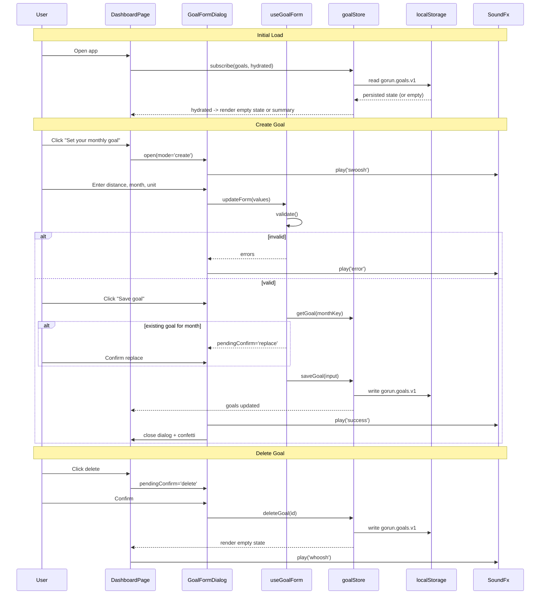

# [STORY-01] Create a Monthly Running Distance Goal - Implementation Planning

> **Source**: [docs/stories/01-create-monthly-distance-goal.md](../stories/01-create-monthly-distance-goal.md)
> **JIRA**: Not available — no JIRA CLI configured in this workspace. Story details supplied manually.
> **Workspace constraints** (from [Agents.md](../../Agents.md)): responsive website, **client-side only** (no backend), TypeScript, playful style with pastel colors, animations, sounds for user actions and system reactions.

## User Story

**As a** runner,
**I want** to set a monthly running distance target (e.g. 100 km),
**so that** I have a clear, measurable objective to work towards.

## Pre-conditions

- Project scaffold exists: Vite + React 18 + TypeScript + TailwindCSS.
- No backend, API, or authentication exists. All persistence is browser-local (`localStorage`).
- This is the **first** feature story — no goal domain model, store, routing, or design tokens exist yet. This plan therefore includes the foundational setup required to deliver the slice end-to-end.
- Animation library (Framer Motion) and audio library (Howler) are available as dependencies.
- No prior goal data exists for a first-time visitor; the dashboard must handle the empty state.

## Design

### Visual Layout

Two surfaces make up this slice:

1. **Dashboard (`/`)**
   - Playful gradient page background with soft floating blobs.
   - Centered `max-w-3xl` column.
   - **Empty state**: illustrated card ("No goal yet") with a bouncing primary CTA — *Set your monthly goal*.
   - **Goal state**: `GoalSummaryCard` showing the month name, target distance in large display type, unit chip, and `Edit` / `Delete` icon buttons in the card's top-right.
2. **Goal form modal (`GoalFormDialog`)**
   - Centered rounded-3xl pastel card, scrim behind.
   - Fields stacked: **Month** (month picker), **Target distance** (number input + stepper), **Unit** (segmented control: km / mi).
   - Playful "quick pick" chips (50 / 100 / 150 / 200) that fill the distance field.
   - Footer: secondary `Cancel`, primary `Save goal`.
3. **Confirmation dialogs** — `ConfirmDialog` reused for "replace existing goal for this month?" and "delete this goal?".

### Color and Typography

- **Background Colors**:
  - Page: `bg-gradient-to-b from-pastel-mint via-pastel-sky to-pastel-lilac`
  - Surface: `bg-white/80 backdrop-blur-sm`
  - Accent (primary action): `bg-pastel-coral hover:bg-pastel-coral-dark`
  - Destructive: `bg-pastel-rose hover:bg-pastel-rose-dark`
- **Typography**:
  - Display (target distance): `font-display text-6xl font-extrabold tracking-tight text-slate-800`
  - Headings: `font-display text-2xl font-bold text-slate-800`
  - Body: `font-sans text-base text-slate-600`
  - Helper/error: `text-sm text-slate-500` / `text-sm text-rose-600`
- **Component-Specific**:
  - Cards: `rounded-3xl bg-white/80 shadow-soft hover:shadow-lifted ring-1 ring-white/60`
  - Buttons: `rounded-full px-6 py-3 font-semibold text-white shadow-soft`
  - Inputs: `rounded-2xl border-2 border-slate-200 focus:border-pastel-sky-dark focus:ring-4 focus:ring-pastel-sky/40`
  - Segmented control: `rounded-full bg-slate-100 p-1` with an animated `layoutId` pill behind the active option.

Pastel palette to register in `tailwind.config.ts`: `mint #C7F0DB`, `sky #BFE3FF`, `lilac #E0D7FF`, `coral #FFC2B4`, `lemon #FFF1B8`, `rose #FFD3DE`, each with a `-dark` companion for hover/active.

### Interaction Patterns

- **Primary button**:
  - Hover: background + `scale-105` transition (150ms ease-out).
  - Click: `scale-95`, plays `pop` sound.
  - Loading/disabled: reduced opacity, pointer-events off, no sound.
  - Accessibility: visible focus ring (`focus-visible:ring-4`), Enter/Space activation.
- **Form field**:
  - Focus: border highlight + soft ring, plays a subtle `focus` tick (throttled, first focus only per field).
  - Validation: inline error text fades in below the field; the field shakes (`x: [0,-6,6,-4,4,0]`, 300ms) and plays the `error` sound.
  - Success on save: card scales in, confetti burst, plays the `success` chime.
  - Accessibility: every field has a `<label>`; errors are wired via `aria-describedby` and announced in an `aria-live="polite"` region.

**Sound map** (see `useSound` hook):

| Event | Sound key | Trigger |
| --- | --- | --- |
| Button / chip press | `pop` | User action |
| Field focus | `tick` | User action |
| Goal saved | `success` | System reaction |
| Validation failure | `error` | System reaction |
| Goal deleted | `whoosh` | System reaction |
| Dialog open/close | `swoosh` | System reaction |

Sound is **on by default but must be mutable**; the preference persists to `localStorage` and a mute toggle lives in the header. All audio respects `prefers-reduced-motion` only for animation, not for audio — audio has its own toggle.

### Measurements and Spacing

- **Container**:
  ```
  max-w-3xl mx-auto px-4 sm:px-6 lg:px-8
  ```
- **Component Spacing**:
  ```
  - Vertical rhythm: space-y-6
  - Form field gap: space-y-5
  - Section padding: py-10 md:py-16
  - Card padding: p-6 md:p-8
  - Dialog padding: p-6
  ```

### Responsive Behavior

- **Desktop (lg: 1024px+)**:
  ```
  - Dashboard card: single centered column, max-w-3xl
  - Dialog: centered modal, w-[28rem]
  - Display distance: text-7xl
  ```
- **Tablet (md: 768px - 1023px)**:
  ```
  - Dashboard card: max-w-2xl
  - Dialog: centered modal, w-[26rem]
  - Display distance: text-6xl
  ```
- **Mobile (sm: < 768px)**:
  ```
  - Full-width stacked layout, px-4
  - Dialog: bottom sheet (rounded-t-3xl, slides up from bottom)
  - Display distance: text-5xl
  - Footer buttons: full-width, stacked
  ```

## Technical Requirements

### Component Structure

```
src/
├── main.tsx                                  # App bootstrap
├── App.tsx                                   # Layout shell + routes
├── features/goal/
│   ├── DashboardPage.tsx                     # Route view: empty state or goal summary
│   └── _components/
│       ├── GoalEmptyState.tsx                # Illustration + "Set your monthly goal" CTA
│       ├── GoalSummaryCard.tsx               # Month, target, unit, edit/delete actions
│       ├── GoalFormDialog.tsx                # Create/edit modal, owns form submit
│       ├── MonthPicker.tsx                   # Month + year selection control
│       ├── DistanceInput.tsx                 # Number input with steppers + quick-pick chips
│       ├── UnitToggle.tsx                    # Segmented km / mi control
│       └── useGoalForm.ts                    # Form state, validation, submit orchestration
├── components/ui/
│   ├── Button.tsx                            # Playful pastel button, press animation + sound
│   ├── Dialog.tsx                            # Animated modal / mobile bottom sheet
│   ├── ConfirmDialog.tsx                     # Replace / delete confirmation
│   ├── FieldError.tsx                        # Animated inline error message
│   └── Confetti.tsx                          # Success celebration burst
├── store/
│   ├── goalStore.ts                          # Zustand store, localStorage persisted
│   └── settingsStore.ts                      # Unit preference + sound mute, persisted
├── lib/
│   ├── distance.ts                           # Unit conversion + formatting helpers
│   ├── month.ts                              # Month key (YYYY-MM), labels, current month
│   ├── validation.ts                         # Goal input validation rules
│   └── sound.ts                              # Howler sprite registry + play()
├── hooks/
│   ├── useSound.ts                           # Mute-aware sound playback
│   └── useReducedMotion.ts                   # Disables non-essential animation
└── types/
    └── goal.ts                               # Goal, DistanceUnit, MonthKey types
```

### Required Components

- DashboardPage ✅
- GoalEmptyState ✅
- GoalSummaryCard ✅
- GoalFormDialog ✅
- MonthPicker ✅
- DistanceInput ✅
- UnitToggle ✅
- Button ✅
- Dialog ✅
- ConfirmDialog ✅
- FieldError ✅
- Confetti ✅
- useGoalForm ✅
- useSound ✅
- goalStore ✅
- settingsStore ✅

### State Management Requirements

```typescript
// src/types/goal.ts
export type DistanceUnit = 'km' | 'mi';
export type MonthKey = string; // 'YYYY-MM'

export interface Goal {
  id: string;
  monthKey: MonthKey;
  targetDistance: number;   // stored in the unit it was entered in
  unit: DistanceUnit;
  createdAt: string;        // ISO
  updatedAt: string;        // ISO
}

// src/store/goalStore.ts
interface GoalStoreState {
  goals: Record<MonthKey, Goal>;
  hydrated: boolean;
}

interface GoalStoreActions {
  getGoal: (monthKey: MonthKey) => Goal | undefined;
  saveGoal: (input: GoalInput) => Goal;       // create or replace for monthKey
  updateGoal: (id: string, patch: Partial<GoalInput>) => void;
  deleteGoal: (id: string) => void;
}

// src/store/settingsStore.ts
interface SettingsStoreState {
  preferredUnit: DistanceUnit;   // defaults to 'km'
  soundEnabled: boolean;         // defaults to true
  setPreferredUnit: (unit: DistanceUnit) => void;
  toggleSound: () => void;
}

// src/features/goal/_components/useGoalForm.ts
interface GoalFormState {
  // UI States
  isDialogOpen: boolean;
  mode: 'create' | 'edit';
  isSubmitting: boolean;
  pendingConfirm: 'replace' | 'delete' | null;

  // Form States
  values: { monthKey: MonthKey; targetDistance: string; unit: DistanceUnit };
  errors: Partial<Record<'monthKey' | 'targetDistance', string>>;
  isDirty: boolean;
}
```

Persistence uses Zustand's `persist` middleware with key `gorun.goals.v1` / `gorun.settings.v1` and a `version` field so future migrations are possible.

## Acceptance Criteria

### Layout & Content

1. Header Section
   ```
   - App wordmark (left-aligned)
   - Sound mute toggle (right-aligned)
   - Static on scroll (single-screen feature)
   - Mobile: wordmark + icon button, no collapse needed
   ```
2. Main Content Area
   ```
   - Single centered column, max-w-3xl
   - Empty state OR goal summary card (mutually exclusive)
   - Mobile: full-width stacked
   ```
3. Goal Form Dialog
   ```
   - Month picker, distance input, unit toggle stacked
   - Quick-pick distance chips above the input
   - Footer actions: Cancel (secondary), Save goal (primary)
   - Mobile: bottom sheet presentation
   ```

### Functionality

1. Create goal

   - [x] A goal is created by entering a target distance and selecting the calendar month it applies to.
   - [x] The month picker defaults to the current month and allows selecting the current month or any future month.
   - [x] Target distance accepts positive numbers with at most one decimal place.
   - [x] Quick-pick chips (50 / 100 / 150 / 200) populate the distance field.
   - [x] `Save goal` is disabled until the form is valid.

2. Unit selection

   - [x] Unit (km or mi) is selectable in the form via the segmented toggle.
   - [x] The chosen unit is stored on the goal **and** written to `settingsStore.preferredUnit`.
   - [x] The preferred unit pre-selects the toggle on the next goal creation.
   - [x] Every distance rendered anywhere in the app uses the same unit and formatter (`formatDistance`).

3. Single active goal per month

   - [x] Saving a goal for a month that already has one shows a replace-confirmation dialog first.
   - [x] Confirming replaces the existing target; cancelling leaves the original goal untouched and keeps the form open.
   - [x] The store never holds two goals for the same `monthKey`.

4. Dashboard visibility

   - [x] Immediately after a successful save, the dialog closes and the goal summary card is visible on the dashboard.
   - [x] The saved goal survives a full page reload (localStorage hydration).
   - [x] Before hydration completes, a skeleton is shown rather than the empty state (prevents a flash of "no goal").

5. Edit and delete

   - [x] An existing goal can be edited while the goal month has not ended; the form opens pre-filled.
   - [x] An existing goal can be deleted after confirmation, returning the dashboard to the empty state.
   - [x] Edit and delete controls are hidden (not merely disabled) for a goal whose month has already ended.

6. Playful feedback

   - [x] Saving triggers a confetti burst and the `success` sound.
   - [x] Validation failure shakes the offending field and plays the `error` sound.
   - [x] Deleting animates the card out and plays the `whoosh` sound.
   - [x] Muting silences all sounds and the preference persists across reloads.
   - [x] With `prefers-reduced-motion: reduce`, decorative motion (confetti, blobs, shake) is replaced by instant state changes; functional transitions remain under 100ms.

### Navigation Rules

- The dashboard at `/` is the only route in this slice; no new routes are introduced.
- The goal form is a modal overlay, not a separate page — the dashboard stays mounted behind it.
- Opening the dialog traps focus; closing returns focus to the trigger element.
- `Escape` and scrim click close the dialog; if the form is dirty, a discard confirmation is shown first.
- Browser back while the dialog is open closes the dialog rather than leaving the app (history state entry pushed on open).

### Error Handling

- **Validation errors** (empty distance, zero or negative, non-numeric, above a 2,000 km sanity ceiling, month in the past) are surfaced inline per field; submission is blocked and the first invalid field receives focus.
- **Storage errors** — `localStorage` unavailable or quota exceeded (private browsing) — surface a non-blocking banner: "We couldn't save your goal on this device." The goal remains in memory for the session so the user is not blocked.
- **Corrupt or unparseable persisted data** is discarded on hydration, the store falls back to empty, and a one-time notice is shown; the app never crashes on bad stored JSON.
- **Unexpected render errors** are caught by an error boundary around `DashboardPage` that offers a retry.

## Modified Files

```
src/
├── main.tsx ✅
├── App.tsx ✅
├── index.css ✅
├── features/goal/
│   ├── DashboardPage.tsx ✅
│   ├── DashboardPage.test.tsx ✅
│   └── _components/
│       ├── GoalEmptyState.tsx ✅
│       ├── GoalSummaryCard.tsx ✅
│       ├── GoalFormDialog.tsx ✅
│       ├── MonthPicker.tsx ✅
│       ├── DistanceInput.tsx ✅
│       ├── UnitToggle.tsx ✅
│       └── useGoalForm.ts ✅
├── components/ui/
│   ├── Button.tsx ✅
│   ├── Dialog.tsx ✅
│   ├── ConfirmDialog.tsx ✅
│   ├── FieldError.tsx ✅
│   ├── Confetti.tsx ✅
│   └── ErrorBoundary.tsx ✅
├── store/
│   ├── goalStore.ts ✅
│   ├── goalStore.test.ts ✅
│   └── settingsStore.ts ✅
├── lib/
│   ├── distance.ts ✅
│   ├── month.ts ✅
│   ├── validation.ts ✅
│   ├── storage.ts ✅
│   └── sound.ts ✅
├── hooks/
│   ├── useSound.ts ✅
│   ├── useReducedMotion.ts ✅
│   └── useStorageIssue.ts ✅
├── test/setup.ts ✅
└── types/
    └── goal.ts ✅

package.json ✅
tsconfig.json ✅
vite.config.ts ✅
tailwind.config.ts ✅
postcss.config.js ✅
index.html ✅
```

## Status

🟩 COMPLETED

**Delivered in:** `index.html`, `style.css`, `app.core.js`, `app.domain.js`, `app.store.js`, `app.ui.core.js`, `script.js`
**Verified by:** tests.html (Distance/units, Months, Goal validation) + live-UI acceptance run
**Note:** Re-implemented in the dependency-free vanilla build per Agents.md; the React implementation under `src/` is retained for reference only. Goal create/edit/delete, the one-goal-per-month invariant, unit preference, confetti/sound feedback and storage-failure degradation all run without a build step.

1. Setup & Configuration

   - [x] Scaffold Vite + React + TypeScript project with strict mode enabled
   - [x] Install and configure TailwindCSS; register pastel palette, `shadow-soft`/`shadow-lifted`, display font
   - [x] Install Zustand and Framer Motion; add `zustand/persist` setup
   - [x] Implement the Web Audio sound engine in `lib/sound.ts` (see deviation note)
   - [x] Configure Vitest + React Testing Library + `jest-axe`

2. Layout Implementation

   - [x] Build `App.tsx` shell: gradient background, animated blobs, header with sound toggle
   - [x] Build `Button`, `Dialog` (modal ↔ bottom sheet), `FieldError`, `ConfirmDialog`, `Confetti`
   - [x] Build `DashboardPage` with hydration skeleton, empty state, and goal state branches
   - [x] Verify responsive behavior via Tailwind breakpoints and browser check

3. Feature Implementation

   - [x] Define `types/goal.ts` and the `lib/month.ts`, `lib/distance.ts`, `lib/validation.ts` helpers
   - [x] Implement `goalStore` (save/delete, one-goal-per-month invariant, persistence, corrupt-data recovery)
   - [x] Implement `settingsStore` (preferred unit, sound mute)
   - [x] Build `MonthPicker`, `DistanceInput` with quick picks, `UnitToggle` with animated pill
   - [x] Build `useGoalForm` (validation, blur validation, dirty tracking, replace/discard orchestration)
   - [x] Build `GoalFormDialog` and wire create / edit / delete flows to the store
   - [x] Wire sound + animation feedback for save, error, delete, and dialog transitions
   - [x] Implement storage-failure banner and error boundary

4. Testing
   - [x] Unit tests for validation, month, and distance helpers
   - [x] Store tests: create, replace-for-same-month, delete, persistence round-trip, corrupt-data recovery, write failure
   - [x] Component/integration tests for the create → visible-on-dashboard flow, edit, and delete
   - [x] Reduced-motion, sound-mute, and accessibility (axe, focus restore, aria wiring) tests

**Verification**: 79/79 assertions passing in `tests.html` (open it in a browser — no build step) · live-UI acceptance run · manual browser check of create, persist-on-reload, and edit/delete flows.

## Implementation Deviations

1. **Sounds are synthesised, not sampled.** The plan assumed Howler plus six licensed audio files. No such assets were available, so `lib/sound.ts` generates each cue with the Web Audio API instead. This removes the `howler` dependency and the asset licensing requirement, keeps the app fully offline, and preserves the planned `play(key)` API and sound map. Swapping in real samples later only touches that one module.
2. **`nanoid` replaced by `crypto.randomUUID()`.** One less dependency for the same result, with a timestamp fallback for older browsers.
3. **Blur-time validation added.** The plan required both "save disabled until valid" and "inline per-field errors". Those conflict — a permanently disabled button can never surface an error. Fields now validate on blur, so the runner is told *why* save is unavailable.
4. **Validation errors no longer steal focus.** The original auto-focus-on-error behaviour fought with blur validation. The first invalid field is still identified by `firstInvalidField` for submit-path use.
5. **`updateGoal` was not implemented.** `saveGoal` is keyed by `monthKey` and already handles both create and replace while preserving `id` and `createdAt`, so a separate update action would have been a redundant second path to the same invariant.

## Dependencies

- `react`, `react-dom`, `typescript`, `vite`
- `tailwindcss`, `postcss`, `autoprefixer`
- `zustand` (state + `persist` middleware)
- `framer-motion` (dialog transitions, layout pill, confetti, shake)
- Dev: `vitest`, `@testing-library/react`, `@testing-library/user-event`, `jest-axe`, `jsdom`
- ~~`howler` + licensed sound assets~~ — replaced by Web Audio synthesis (see deviations)
- ~~`nanoid`~~ — replaced by `crypto.randomUUID()`

## Related Stories

- STORY-02 (Generate a Systematic Weekly Run Plan) — consumes the saved monthly goal; plan regeneration on goal edit is handled there, not here.
- STORY-11 (View Monthly Goal Progress) — reads the same `Goal` record and the shared unit preference.
- STORY-19 (Responsive Mobile Web Experience) — the responsive criteria in this plan are the first concrete instance of that story.

## Notes

### Technical Considerations

1. **Client-side only.** There is no API. `localStorage` via Zustand `persist` is the system of record, so hydration timing, quota errors, and schema versioning must be handled explicitly rather than assumed away.
2. **Store the entered unit, don't silently convert.** Keep `targetDistance` in the unit the runner typed and convert only at render time. This avoids float drift from repeated km↔mi round-trips when a goal is edited many times.
3. **Month identity is a `YYYY-MM` string, not a `Date`.** Comparing months by string key sidesteps timezone off-by-one bugs; use the user's local timezone once, when computing the current month key.
4. **One goal per month is a store invariant, not a UI rule.** `saveGoal` keys by `monthKey` so the invariant holds even if a future screen calls it directly; the confirmation dialog is only the UX around it.
5. **Audio needs a user gesture.** Browsers block autoplay, so the Howler context must be unlocked on the first user interaction; `useSound` should no-op silently before unlock rather than throwing.
6. **Reduced motion is an accessibility requirement, not a nicety.** Route all decorative motion through `useReducedMotion` so the playful style degrades gracefully.
7. **This story carries foundation cost.** Being the first slice, it establishes the design tokens, UI primitives, store pattern, and sound system that later stories reuse — size it accordingly.

### Business Requirements

- The monthly distance goal is the anchor from which weekly and daily plans are derived (STORY-02); its data shape must be stable before plan generation is built.
- Unit preference is global to the runner, not per-goal-entry, so distances never appear in mixed units.
- Goals for past months are historical records and must remain readable but immutable.
- The playful, encouraging tone is a product requirement — goal creation should feel like a small celebration, reinforcing the mentoring positioning of the product.

### API Integration

**Not applicable for this slice.** The app is client-side only; there is no server, no fetch layer, and no mock server. The storage layer below is the equivalent boundary.

#### Type Definitions

```typescript
// src/types/goal.ts
export type DistanceUnit = 'km' | 'mi';
export type MonthKey = string; // 'YYYY-MM'

export interface Goal {
  id: string;
  monthKey: MonthKey;
  targetDistance: number;
  unit: DistanceUnit;
  createdAt: string;
  updatedAt: string;
}

export interface GoalInput {
  monthKey: MonthKey;
  targetDistance: number;
  unit: DistanceUnit;
}

export interface PersistedGoalState {
  version: 1;
  goals: Record<MonthKey, Goal>;
}

export type GoalValidationErrors = Partial<
  Record<'monthKey' | 'targetDistance', string>
>;
```

#### Persisted Shape

```json
// localStorage key: gorun.goals.v1
{
  "version": 1,
  "goals": {
    "2026-10": {
      "id": "V1StGXR8_Z5jdHi6B",
      "monthKey": "2026-10",
      "targetDistance": 100,
      "unit": "km",
      "createdAt": "2026-09-21T09:12:00.000Z",
      "updatedAt": "2026-09-21T09:12:00.000Z"
    }
  }
}
```

```json
// localStorage key: gorun.settings.v1
{
  "version": 1,
  "preferredUnit": "km",
  "soundEnabled": true
}
```

### State Management Flow



### Custom Hook Implementation

```typescript
// src/hooks/useSound.ts
const useSound = () => {
  const soundEnabled = useSettingsStore((s) => s.soundEnabled);
  const unlockedRef = useRef(false);

  useEffect(() => {
    // Browsers block audio until a user gesture; unlock on the first one.
    const unlock = () => {
      Howler.ctx?.resume();
      unlockedRef.current = true;
    };
    window.addEventListener('pointerdown', unlock, { once: true });
    window.addEventListener('keydown', unlock, { once: true });
    return () => {
      window.removeEventListener('pointerdown', unlock);
      window.removeEventListener('keydown', unlock);
    };
  }, []);

  const play = useCallback(
    (key: SoundKey) => {
      if (!soundEnabled || !unlockedRef.current) return;
      soundSprite.play(key);
    },
    [soundEnabled]
  );

  return { play, soundEnabled };
};

// src/features/goal/_components/useGoalForm.ts
const useGoalForm = () => {
  const { goals, saveGoal, deleteGoal } = useGoalStore();
  const { preferredUnit, setPreferredUnit } = useSettingsStore();
  const { play } = useSound();

  const [values, setValues] = useState<GoalFormValues>(() => ({
    monthKey: currentMonthKey(),
    targetDistance: '',
    unit: preferredUnit,
  }));
  const [errors, setErrors] = useState<GoalValidationErrors>({});
  const [pendingConfirm, setPendingConfirm] = useState<'replace' | 'delete' | null>(null);

  const updateForm = useCallback((patch: Partial<GoalFormValues>) => {
    setValues((prev) => ({ ...prev, ...patch }));
    setErrors({});
  }, []);

  const submit = useCallback(
    (options: { confirmedReplace?: boolean } = {}) => {
      const result = validateGoalInput(values);
      if (!result.ok) {
        setErrors(result.errors);
        play('error');
        return { status: 'invalid' as const };
      }

      if (goals[values.monthKey] && !options.confirmedReplace) {
        setPendingConfirm('replace');
        return { status: 'needs-confirm' as const };
      }

      saveGoal(result.value);
      setPreferredUnit(result.value.unit);
      play('success');
      return { status: 'saved' as const };
    },
    [values, goals, saveGoal, setPreferredUnit, play]
  );

  return { values, errors, pendingConfirm, setPendingConfirm, updateForm, submit, deleteGoal };
};
```

## Testing Requirements

### Integration Tests (Target: 80% Coverage)

1. Core Functionality Tests

```typescript
describe('Create Monthly Distance Goal', () => {
  it('should show the empty state when no goal exists', async () => {});

  it('should create a goal and display it on the dashboard immediately', async () => {});

  it('should default the month picker to the current month', async () => {});

  it('should populate the distance field from a quick-pick chip', async () => {});

  it('should keep the selected unit consistent across the summary card', async () => {});

  it('should ask for confirmation before replacing an existing goal for the same month', async () => {});

  it('should leave the original goal untouched when a replace is cancelled', async () => {});

  it('should open the edit form pre-filled with the existing goal values', async () => {});

  it('should delete a goal after confirmation and return to the empty state', async () => {});

  it('should hide edit and delete controls once the goal month has ended', async () => {});
});
```

2. Responsive Tests

```typescript
describe('Responsive Behavior', () => {
  it('should render the goal form as a bottom sheet on mobile widths', async () => {});

  it('should render the goal form as a centered modal on desktop widths', async () => {});

  it('should preserve entered form values across a viewport change', async () => {});
});
```

3. Edge Cases

```typescript
describe('Edge Cases', () => {
  it('should reject a zero, negative, or non-numeric target distance', async () => {});

  it('should reject a month in the past', async () => {});

  it('should reject a target distance above the sanity ceiling', async () => {});

  it('should recover to an empty state when persisted data is corrupt', async () => {});

  it('should show a storage warning but keep the goal in memory when localStorage throws', async () => {});

  it('should show a skeleton rather than the empty state before hydration completes', async () => {});
});
```

### Performance Tests

1. Event Performance

```typescript
describe('Performance', () => {
  it('should not re-render the dashboard on every keystroke in the goal form', async () => {});

  it('should write to localStorage once per save rather than per field change', async () => {});
});
```

2. Resource Management

```typescript
describe('Resource Management', () => {
  it('should remove audio unlock listeners when unmounted', async () => {});

  it('should unsubscribe from the store when the dashboard unmounts', async () => {});

  it('should stop and clean up confetti animation frames after the burst', async () => {});
});
```

### Test Environment Setup

```typescript
const mockLocalStorage = (initial?: Record<string, string>) => {
  // Install an in-memory localStorage; supports forcing a quota-exceeded throw.
};

const mockHowler = () => {
  // Stub the sound sprite and expose a spy on play() for sound assertions.
};

const simulateViewportChange = async (width: number, height: number) => {
  // Resize and flush matchMedia listeners.
};

const setReducedMotion = (enabled: boolean) => {
  // Stub matchMedia for '(prefers-reduced-motion: reduce)'.
};

beforeEach(() => {
  mockLocalStorage();
  mockHowler();
  useGoalStore.setState({ goals: {}, hydrated: true });
});
```

### Accessibility Tests

```typescript
describe('Accessibility', () => {
  it('should have no axe violations on the dashboard and the open goal form', async () => {});

  it('should trap focus within the dialog and restore focus to the trigger on close', async () => {});

  it('should associate each field with its label and its error via aria-describedby', async () => {});

  it('should announce validation errors in a live region', async () => {});

  it('should allow completing the entire create flow with the keyboard alone', async () => {});

  it('should disable decorative motion when prefers-reduced-motion is set', async () => {});

  it('should play no sounds when sound is muted', async () => {});
});
```
