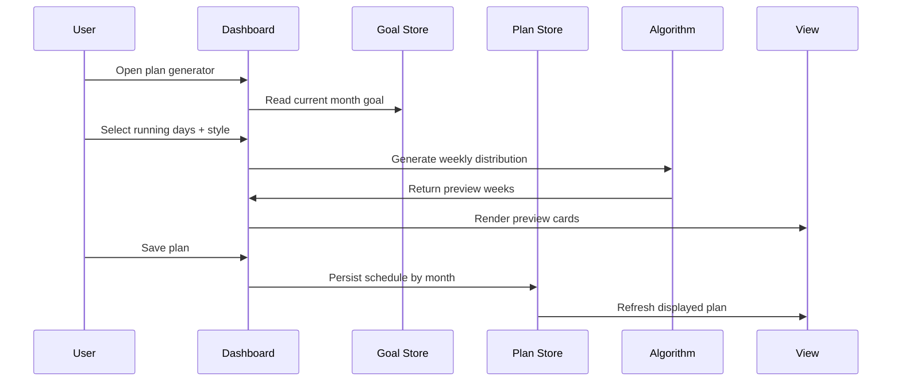

# [STORY-02] Generate a Systematic Weekly Run Plan from My Goal - Implementation Planning

> **Source**: [docs/stories/02-generate-systematic-training-plan.md](../stories/02-generate-systematic-training-plan.md)
> **JIRA**: Not available — no JIRA CLI configured in this workspace. Story details supplied manually.
> **Workspace constraints** (from [Agents.md](../../Agents.md)): responsive website, **client-side only** (no backend), TypeScript, playful style with pastel colors, animations, sounds for user actions and system reactions.

## User Story

**As a** runner,
**I want** the app to break my monthly target into a weekly and per-day run schedule,
**so that** I know exactly how far to run on each day instead of guessing.

## Pre-conditions

- The monthly goal feature from Story 01 is already implemented or at least the goal domain model and persisted store are available.
- The app can resolve the goal month and target distance in the selected unit (`km` or `mi`).
- All scheduling logic runs entirely in-browser using local storage; no backend or API is required.
- The app has existing UI primitives for cards, dialogs, buttons, and responsive layout.
- A runner can have a single active goal for a month, and the plan should be generated for every week in that month.
- The scheduler must also respect the runner-preferred number of running days per week and generate explicit rest-day markers.

## Design

### Visual Layout

The training-plan feature sits alongside the monthly goal dashboard in the same screen flow and is designed to feel like a coach-friendly planner rather than a form-heavy dashboard.

1. **Dashboard enhancement**
   - If a goal exists for the active month, the summary card expands with a new `Training Plan` section beneath the goal summary.
   - A prominent primary button reads: `Generate plan` or `Edit training plan`.
   - The section shows a compact overview: total weekly target, preferred running days, and distribution style.
2. **Plan generator modal / sheet**
   - Centered modal on desktop; bottom-sheet on mobile.
   - Fields stack vertically: running days per week, distribution style, and optional plan notes or summary metadata.
   - Displays a preview of weekly totals and the first generated week before save.
3. **Weekly calendar grid**
   - Each week is represented as a rounded card with a header showing `Week 1`, `Week 2`, etc.
   - Each day in the week uses a pill or row showing either `Run: X km` or `Rest`.
   - Long-run days are visually emphasized with a stronger accent, while rest days are muted and include a distinct badge.
4. **Saved schedule state**
   - The plan is displayed in a read-only summary beneath the goal card after generation.
   - The user can regenerate or customize it without losing the goal context.

### Color and Typography

- **Background Colors**:
  - Page: `bg-gradient-to-b from-pastel-mint via-pastel-sky to-pastel-lilac`
  - Plan cards: `bg-white/80 backdrop-blur-sm`
  - Accent: `bg-pastel-sky hover:bg-pastel-sky-dark`
  - Long-run emphasis: `bg-pastel-coral hover:bg-pastel-coral-dark`
  - Rest days: `bg-slate-100 text-slate-500`
- **Typography**:
  - Section headings: `font-display text-xl font-bold text-slate-800`
  - Week labels: `font-display text-lg font-semibold text-slate-700`
  - Run distance: `font-sans text-base font-semibold text-slate-800`
  - Rest label: `font-sans text-sm text-slate-500`
- **Component-Specific**:
  - Plan cards: `rounded-3xl bg-white/80 shadow-soft ring-1 ring-white/60`
  - Day pills: `rounded-full px-3 py-2 text-sm`
  - CTA buttons: `rounded-full px-5 py-3 font-semibold shadow-soft`

### Interaction Patterns

- **Generate plan**:
  - Click triggers modal animation with a subtle `swoosh` sound.
  - Confirming generation should animate the week cards into place and trigger a celebratory `success` sound.
  - If the user changes the running-days count or style, the preview updates immediately with a smooth transition.
- **Plan editing**:
  - Users can switch between distribution styles without losing previously typed or saved configuration.
  - Regeneration should preserve the goal month and replace the existing saved schedule only after explicit confirmation.
- **Rest-day labeling**:
  - Rest days are always displayed explicitly and styled with a subdued palette so they are easy to scan.
  - Accessibility: all schedule entries are presented with semantic labels and clear contrast values.

### Measurements and Spacing

- **Container**:
  ```
  max-w-5xl mx-auto px-4 sm:px-6 lg:px-8
  ```
- **Component Spacing**:
  ```
  - Vertical rhythm: space-y-6
  - Grid gap: gap-4 md:gap-6
  - Card padding: p-4 md:p-6
  - Week row gap: gap-2 md:gap-3
  ```

### Responsive Behavior

- **Desktop (lg: 1024px+)**:
  ```
  - Grid: grid-cols-2 gap-6 for weekly cards
  - Modal: centered panel with preview on the right and controls on the left
  - Week details: multi-day rows with clear day labels
  ```
- **Tablet (md: 768px - 1023px)**:
  ```
  - Cards: stack vertically in a single-column layout
  - Control panel: full width and compact
  ```
- **Mobile (sm: < 768px)**:
  ```
  - Bottom sheet modal with full-width action buttons
  - Weekly cards stack vertically
  - Day pills wrap to the next line without truncating the value
  ```

## Technical Requirements

### Component Structure

```
src/
├── features/goal/
│   ├── DashboardPage.tsx                     # Goal dashboard with summary and schedule section
│   └── _components/
│       ├── GoalSummaryCard.tsx               # Existing goal summary; add plan CTA section
│       ├── TrainingPlanSection.tsx           # Summary and quick actions for saved plan
│       ├── TrainingPlanDialog.tsx            # Generate/edit plan modal
│       ├── TrainingPlanPreview.tsx           # Weekly/day distribution preview
│       ├── WeekPlanCard.tsx                  # Single week card with per-day distances
│       ├── RunningDaysSelector.tsx          # Number-of-days selector (3/4/5)
│       ├── DistributionStyleToggle.tsx      # Even vs progressive style control
│       ├── useTrainingPlanForm.ts            # Form state, validation, generation flow
│       └── useTrainingPlan.ts               # Plan generation algorithm + storage helpers
├── store/
│   ├── goalStore.ts                         # Existing goal persistence
│   └── trainingPlanStore.ts                 # New persisted plan-by-month schedule state
├── lib/
│   ├── trainingPlan.ts                      # Distribution algorithm helpers
│   ├── month.ts                             # Existing month helpers reused
│   └── distance.ts                          # Unit/formatting helpers reused
├── types/
│   └── trainingPlan.ts                      # Plan, week, and schedule types
└── components/ui/
    └── Button.tsx                           # Existing button primitive reused
```

### Required Components

- DashboardPage ⬜
- GoalSummaryCard ⬜
- TrainingPlanSection ⬜
- TrainingPlanDialog ⬜
- TrainingPlanPreview ⬜
- WeekPlanCard ⬜
- RunningDaysSelector ⬜
- DistributionStyleToggle ⬜
- useTrainingPlanForm ⬜
- useTrainingPlan ⬜
- trainingPlanStore ⬜
- trainingPlan.ts ⬜
- trainingPlan types ⬜

### State Management Requirements

```typescript
// src/types/trainingPlan.ts
export type DistributionStyle = 'even' | 'progressive';
export type TrainingDay = 'run' | 'rest';

export interface TrainingPlanDay {
  dayNumber: number;        // 1..7 or month-day index within week
  type: TrainingDay;
  distanceKm?: number;      // stored in the target's preferred unit, or normalized to km internally
  label: string;
}

export interface TrainingWeek {
  weekIndex: number;
  days: TrainingPlanDay[];
  totalDistance: number;
}

export interface TrainingPlan {
  id: string;
  monthKey: string;         // 'YYYY-MM'
  runningDaysPerWeek: 3 | 4 | 5;
  distributionStyle: DistributionStyle;
  createdAt: string;
  updatedAt: string;
  weeks: TrainingWeek[];
}
```

```typescript
// src/store/trainingPlanStore.ts
interface TrainingPlanStoreState {
  plans: Record<string, TrainingPlan>;
  hydrated: boolean;
  savePlan: (plan: Omit<TrainingPlan, 'id' | 'createdAt' | 'updatedAt'>) => TrainingPlan;
  upsertPlan: (monthKey: string, plan: Partial<TrainingPlan>) => TrainingPlan;
  deletePlan: (monthKey: string) => void;
}
```

The plan store should use the same persist pattern as the goal store (`gorun.training-plan.v1`) so that generated schedules survive refreshes and page reloads. The core algorithm should be pure and testable so it can be verified without UI state.

## Acceptance Criteria

### Layout & Content

1. Header Section
   ```
   - The dashboard continues to show the current goal summary.
   - A training-plan action appears immediately beneath the summary when a month goal exists.
   - The action remains visible and accessible in mobile layout.
   ```

2. Main Content Area
   ```
   - If no goal exists, the training plan section remains hidden or disabled.
   - If a goal exists, the generated plan is displayed as a list of week cards.
   - Each card includes a week summary and day-by-day distances.
   ```

3. Training Plan Dialog
   ```
   - The user selects the number of running days per week: 3, 4, or 5.
   - The user chooses a distribution style: even split or progressive/long-run split.
   - The preview updates live to reflect the target allocation.
   ```

### Functionality

1. Goal-based planning

   - [ ] Given a monthly target, the app calculates the weekly target (e.g., 100 km/month → ~25 km/week).
   - [ ] The app preserves the goal's month and unit during plan generation.
   - [ ] The monthly goal is the source of truth for the schedule.

2. Weekly schedule generation

   - [ ] The app divides the target across the selected number of running days per week.
   - [ ] The app covers every week of the goal month and saves a plan for that month.
   - [ ] Rest days are shown explicitly and clearly defined.

3. Distribution styles

   - [ ] The app offers an even distribution style (such as 5 km × 5 days).
   - [ ] The app offers a progressive or long-run style with a longer run and comparatively shorter mid-week runs.
   - [ ] The preview clearly shows the resulting per-day distances.

4. Persistence and management

   - [ ] The generated plan is saved to local storage and reloaded on revisit.
   - [ ] The user can regenerate a plan without losing the underlying goal.
   - [ ] Existing plans are replaced only when the user confirms the action.

### Navigation Rules

- The plan editor is accessed from the goal summary card or dashboard.
- The plan preview is read-only until the user chooses to generate or edit it.
- Rest days should never be omitted or implied as hidden slots.
- The planner should operate within the selected month and never create cross-month schedules.

### Error Handling

- If no monthly goal exists, the plan action is disabled and explains why.
- If a plan cannot be saved to local storage, the UI shows a non-blocking warning without crashing the app.
- If the monthly target is too small for the selected frequency, the algorithm should still generate a valid schedule without producing zero-length run days.

## Modified Files

```
src/
├── features/goal/
│   ├── DashboardPage.tsx ⬜
│   └── _components/
│       ├── GoalSummaryCard.tsx ⬜
│       ├── TrainingPlanSection.tsx ⬜
│       ├── TrainingPlanDialog.tsx ⬜
│       ├── TrainingPlanPreview.tsx ⬜
│       ├── WeekPlanCard.tsx ⬜
│       ├── RunningDaysSelector.tsx ⬜
│       ├── DistributionStyleToggle.tsx ⬜
│       ├── useTrainingPlanForm.ts ⬜
│       └── useTrainingPlan.ts ⬜
├── store/
│   ├── goalStore.ts ⬜
│   └── trainingPlanStore.ts ⬜
├── lib/
│   ├── trainingPlan.ts ⬜
│   ├── month.ts ⬜
│   └── distance.ts ⬜
├── types/
│   └── trainingPlan.ts ⬜
└── components/ui/
    └── Button.tsx ⬜
```

## Status

🟩 COMPLETED

**Delivered in:** `index.html`, `style.css`, `app.core.js`, `app.domain.js`, `app.store.js`, `app.ui.core.js`
**Verified by:** tests.html (Training plan, stories 2 and 3) + live-UI acceptance run
**Note:** Re-implemented in the dependency-free vanilla build per Agents.md; the React implementation under `src/` is retained for reference only. Plan generation for every week of the goal month, 3/4/5 running days, even and progressive distributions and explicit rest days are pure functions in `app.domain.js`.

1. Setup & Configuration

   - [x] Confirm the active goal and month context are available from the existing goal store.
   - [x] Add training-plan types and persisted store structure.
   - [x] Reuse the current UI shell and sound conventions for plan dialogs.

2. Layout Implementation

   - [x] Extend dashboard layout with a training-plan summary panel.
   - [x] Create reusable week-card arrangement for each generated week.
   - [x] Build responsive modal / sheet shell with form controls and live preview.

3. Feature Implementation

   - [x] Implement the allocation algorithm for weekly and per-day distances.
   - [x] Support both even and progressive/long-run distributions.
   - [x] Persist plan output to local storage and rehydrate it on page load.
   - [x] Wire edit / regenerate flow and confirm-before-replace logic.

4. Testing

   - [x] Add unit tests for weekly target and distribution calculations.
   - [x] Add tests for valid/invalid month-goal scenarios.
   - [x] Add UI tests for generating, previewing, and saving a plan.
   - [x] Add accessibility checks for rest-day labeling and plan actions.

## Dependencies

- Story 01 goal creation and local persistence.
- Existing reusable UI primitives from the dashboard feature.
- Month and unit helper logic from the goal domain.
- Zustand persistence conventions used by the current app-level store design.
- Tailwind styling tokens and motion behaviors already established in the app.

## Related Stories

- [STORY-01] Create a Monthly Running Distance Goal
- [STORY-03] Customise Run Plan Schedule
- [STORY-09] Track Daily Plan Completion

## Notes

### Technical Considerations

1. The scheduler must treat `runningDaysPerWeek` as a user preference with a constrained set of valid values (3, 4, 5).
2. The implementation should normalize internal distance values to a consistent unit to avoid rounding drift across conversions.
3. The `progressive` distribution must ensure the longest run is labeled clearly while preserving realistic spread across the week.
4. The plan should be generated for every week in the target month and never exceed the target month boundary.
5. The store should handle plan replacement carefully to avoid accidentally overwriting the goal with a schedule artifact.

### Business Requirements

- The runner needs a realistic weekly pattern rather than a mathematically perfect but unrealistic daily plan.
- The app should help reduce decision fatigue by turning an abstract monthly target into actionable daily steps.
- Rest days must be explicit to support recovery and make the schedule trustworthy.
- The generated schedule should feel motivating and easy to scan, especially on mobile devices.

### API Integration

No external API is required for this feature. The implementation remains entirely local and uses the existing browser storage and state patterns.

#### Type Definitions

```typescript
interface DistributionInput {
  targetDistance: number;
  unit: 'km' | 'mi';
  monthlyDays: number;
  runningDaysPerWeek: 3 | 4 | 5;
  style: 'even' | 'progressive';
}

interface WeeklyAllocation {
  weekIndex: number;
  totalDistance: number;
  runningDays: number;
  restDays: number;
}
```

### Mock Implementation

#### Mock Plan Generation

```typescript
// filepath: src/lib/trainingPlan.ts
export function generateTrainingPlan(input: DistributionInput): WeeklyAllocation[] {
  // Produce a plan for every week in the month, with working-day totals
  // even: distribute evenly across running days
  // progressive: allocate shorter mid-week runs with one longer run
  return [];
}
```

### State Management Flow



### Custom Hook Implementation

```typescript
const useTrainingPlanForm = () => {
  const goal = useGoalStore((state) => state.getGoal(activeMonthKey));

  const [runningDays, setRunningDays] = useState<3 | 4 | 5>(4);
  const [style, setStyle] = useState<'even' | 'progressive'>('even');

  const preview = useMemo(() => {
    if (!goal) return [];
    return generateTrainingPlan({
      targetDistance: goal.targetDistance,
      unit: goal.unit,
      monthlyDays: 30,
      runningDaysPerWeek: runningDays,
      style,
    });
  }, [goal, runningDays, style]);

  return {
    runningDays,
    style,
    preview,
    setRunningDays,
    setStyle,
  };
};
```

## Testing Requirements

### Integration Tests (Target: 80% Coverage)

1. Core Functionality Tests

```typescript
describe('Training plan generation', () => {
  it('should calculate the weekly distance from a monthly target', () => {
    // Test expected target division for week totals
  });

  it('should generate a schedule for each week in the selected month', () => {
    // Test multi-week coverage
  });

  it('should render explicit rest days in the plan', () => {
    // Test day-by-day schedule output
  });
});
```

2. Responsive Tests

```typescript
describe('Training plan responsive behavior', () => {
  it('should maintain readable week cards on mobile layouts', () => {
    // Verify stacked layout and wrapped labels
  });

  it('should keep the generator unobtrusive on small screens', () => {
    // Verify modal sheet rendering and action button layout
  });
});
```

3. Edge Cases

```typescript
describe('Training plan edge cases', () => {
  it('should handle very small goals without invalid zero-day runs', () => {
    // Ensure minimum realistic distances are preserved
  });

  it('should gracefully handle a missing goal', () => {
    // Show disabled or explanatory state
  });

  it('should replace an existing plan only after confirm', () => {
    // Test the confirmation flow
  });
});
```

### Performance Tests

1. Event Performance

```typescript
describe('Training plan performance', () => {
  it('should update the preview quickly when style or running-day count changes', () => {
    // Test with minimal UI delays
  });
});
```

2. Resource Management

```typescript
describe('Training plan resource management', () => {
  it('should not leak intervals or subscriptions when the plan dialog closes', () => {
    // Verify cleanup behavior
  });
});
```

### Accessibility Tests

```typescript
describe('Training plan accessibility', () => {
  it('should provide clear labels for each plan action and day entry', () => {
    // Verify semantic correctness
  });

  it('should announce validation findings or save confirmation in an accessible manner', () => {
    // Verify aria-live and focus behavior
  });
});
```

## Feature Documentation

### Story Format

- Title: Feature - Generate Systematic Weekly Run Plan
- User Story
  - Clear description of turning a monthly training goal into a structured weekly schedule.
- Pre-conditions
  - Goal exists and can be resolved for a month.
  - No backend needed; local persistence only.
- Design
  - Dashboard and modal preview flow.
  - Pastel card styles and responsive scheduling layout.
- Technical Requirements
  - Component tree for dashboard enhancement and plan generation.
  - State store definitions for goal and plan persistence.
  - Pure generation algorithm for weekly distance distribution.
- Acceptance Criteria
  - Monthly goal to weekly plan logic.
  - Even vs progressive distribution support.
  - Explicit rest days and save flows.
- Modified Files
  - Files to update for dashboard, store, lib, and types.
- Status
  - Completed; setup, layout, feature and testing checklists are all ticked.
- Dependencies
  - Story 01 goal functionality and app established patterns.
- Related Stories
  - Goal creation, schedule customization, and daily tracking stories.
- Notes
  - Technical and business trade-offs, plus local persistence constraints.
