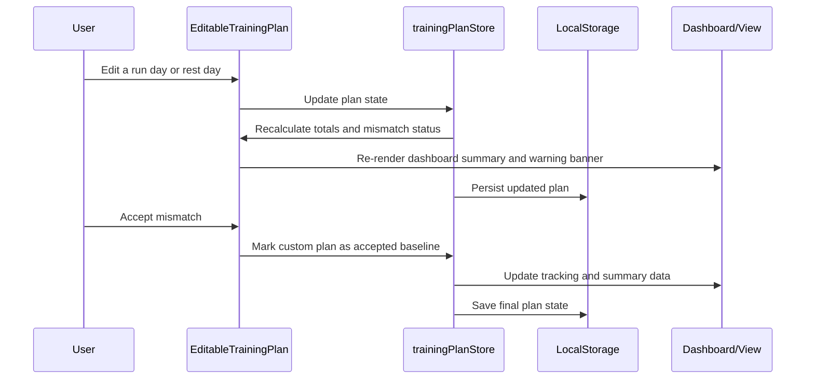

# [STORY-03] Customise My Generated Run Plan - Implementation Planning

> **Source**: [docs/stories/03-customise-run-plan-schedule.md](../stories/03-customise-run-plan-schedule.md)
> **JIRA**: Not available — no JIRA CLI configured in this workspace. Story details supplied manually.
> **Workspace constraints** (from [Agents.md](../../Agents.md)): responsive website, **client-side only** (no backend), TypeScript, playful style with pastel colors, animations, sounds for user actions and system reactions.

## User Story

**As a** runner,
**I want** to manually adjust the suggested distances and run days in my plan,
**so that** the plan fits around my real-life schedule and fitness level.

## Pre-conditions

- The monthly goal and generated training-plan stories are already implemented or available in the app state and persisted stores.
- A saved plan exists for the active month, with weekly day-by-day values and explicit rest-day markers.
- The app has a dashboard view, a plan summary section, and a local storage persistence layer already in place.
- Tracking and dashboard surfaces can render plan-derived values without requiring a backend or external API.
- A runner can compare the current edited plan against the generated baseline and decide whether to keep a mismatch or revert to the original suggestion.

## Design

### Visual Layout

The customisation experience should feel like a coach-driven planner, not a settings page. It is a direct extension of the generated schedule and should stay tightly connected to the dashboard.

1. **Dashboard + plan section**
   - The current goal summary remains at the top of the dashboard.
   - A plan section below it shows the generated schedule and a new `Customise plan` action.
   - If the monthly goal exists, the plan area is visible; if not, it remains hidden or disabled.
2. **Editable week cards**
   - Each week card becomes editable when the runner opens the customisation view.
   - Each day row includes a label for Monday-Sunday (or the actual week layout), distance input for run days, and a toggle for `Run` / `Rest`.
   - Cards are grouped by week and use a clear visual hierarchy: week header, then day rows, then totals summary.
3. **Plan mismatch banner**
   - When the user edits distances or moves run days, a banner appears above the plan stating that the monthly total no longer matches the goal.
   - The component offers two primary choices: `Accept mismatch` and `Reset to suggested plan`.
4. **Mobile / sheet layout**
   - On smaller screens, the editor opens as a bottom sheet that preserves context without taking over the full page.
   - Totals and warning states remain visible above the action buttons so the user still understands the impact on the monthly goal.

### Color and Typography

- **Background Colors**:
  - Page: `bg-gradient-to-b from-pastel-mint via-pastel-sky to-pastel-lilac`
  - Card surfaces: `bg-white/80 backdrop-blur-sm`
  - Warning banner: `bg-amber-50 border border-amber-200 text-amber-800`
  - Rest days: `bg-slate-100 text-slate-500`
  - Run days: `bg-pastel-sky/60 text-slate-800`
  - Modified values: `bg-pastel-lilac/60`
- **Typography**:
  - Section headings: `font-display text-xl font-bold text-slate-800`
  - Week heading: `font-display text-lg font-semibold text-slate-700`
  - Input labels: `font-sans text-sm font-medium text-slate-700`
  - Totals: `font-sans text-base font-semibold text-slate-800`
- **Component-Specific**:
  - Plan cards: `rounded-3xl bg-white/80 shadow-soft ring-1 ring-white/60`
  - Day rows: `rounded-2xl border border-slate-200 bg-slate-50/70`
  - Buttons: `rounded-full px-5 py-3 font-semibold shadow-soft`
  - Warning banner: `rounded-2xl px-4 py-3`

### Interaction Patterns

- **Inline editing**:
  - Distance inputs support decimal values and quick adjustments, preserving unit consistency with the underlying goal.
  - Rest-day toggles are explicit and visible, never implied by omitted values.
  - Moving a run day updates the current week and recalculates totals immediately.
- **Mismatch feedback**:
  - The app warns when a weekly or monthly total no longer matches the monthly goal, using a soft amber status banner.
  - The warning appears while the user edits and remains until they either accept the negotiated plan or reset.
- **Accept vs reset**:
  - `Accept mismatch` keeps the custom schedule and records the plan as the new target baseline for the month.
  - `Reset to suggested plan` restores the algorithm-generated schedule and removes the custom modifications for that week.
- **Accessibility**:
  - Every editable day row has a descriptive label and associated control state.
  - Warning and reset actions must be keyboard accessible and announce status changes via an `aria-live` region.

### Measurements and Spacing

- **Container**:
  ```
  max-w-5xl mx-auto px-4 sm:px-6 lg:px-8
  ```
- **Component Spacing**:
  ```
  - Vertical rhythm: space-y-6
  - Grid gap: gap-4 md:gap-6
  - Card padding: p-4 md:p-6
  - Day row padding: px-3 py-2 md:px-4 md:py-3
  - Warning banner: my-3
  ```

### Responsive Behavior

- **Desktop (lg: 1024px+)**:
  ```
  - Weekly cards: grid-cols-2 gap-6
  - Editor: side-by-side totals panel + editable week grid
  - Action buttons: inline row on the right
  ```
- **Tablet (md: 768px - 1023px)**:
  ```
  - Week cards stack vertically
  - Totals banner remains above the plan controls
  ```
- **Mobile (sm: < 768px)**:
  ```
  - Bottom sheet editor
  - Day rows stack as full-width blocks
  - Buttons fill width and remain grouped at the bottom
  ```

## Technical Requirements

### Component Structure

```
src/
├── features/goal/
│   ├── DashboardPage.tsx                     # Goal dashboard with plan summary and editor entry
│   └── _components/
│       ├── GoalSummaryCard.tsx               # Existing summary; add customisation CTA
│       ├── TrainingPlanSection.tsx           # Read-only summary and actions for saved plan
│       ├── TrainingPlanDialog.tsx            # Generate/edit modal for plan management
│       ├── EditableTrainingPlan.tsx          # Week editor with live totals and mismatch banner
│       ├── EditableWeekCard.tsx              # Per-week customisable schedule card
│       ├── PlanDayRow.tsx                    # Per-day run/rest + distance editor
│       ├── WeeklyTotalsCard.tsx              # Shows weekly and monthly totals
│       ├── PlanMismatchBanner.tsx            # Warning state with accept/reset actions
│       ├── RunningDaysSelector.tsx          # Existing selector reused or extended
│       ├── useTrainingPlanForm.ts            # Existing plan form logic extended for edits
│       └── useTrainingPlanCustomization.ts   # Custom editing flow, validation, mismatch logic
├── store/
│   ├── trainingPlanStore.ts                 # Extend with per-plan edit actions and reset logic
│   └── goalStore.ts                         # Existing source-of-truth goal remains unchanged
├── lib/
│   ├── trainingPlan.ts                      # Pure plan utilities for totals, mismatch checks, and shuffle/move logic
│   ├── distance.ts                          # Unit-aware formatting and conversion helpers
│   └── month.ts                             # Month / range helpers reused
├── types/
│   └── trainingPlan.ts                      # Extend with editable state, mismatch status, and action payloads
└── components/ui/
    ├── Button.tsx                           # Reused action button
    ├── Dialog.tsx                           # Reused for modal/sheet patterns
    └── FieldError.tsx                       # Reused for validation feedback
```

### Required Components

- DashboardPage ⬜
- GoalSummaryCard ⬜
- TrainingPlanSection ⬜
- TrainingPlanDialog ⬜
- EditableTrainingPlan ⬜
- EditableWeekCard ⬜
- PlanDayRow ⬜
- WeeklyTotalsCard ⬜
- PlanMismatchBanner ⬜
- useTrainingPlanCustomization ⬜
- trainingPlanStore ⬜
- trainingPlan.ts ⬜
- trainingPlan types ⬜

### State Management Requirements

```typescript
// src/types/trainingPlan.ts
export type TrainingDay = 'run' | 'rest';

export interface TrainingPlanDay {
  dayNumber: number;       // 1..7, or day-of-week index within the week
  type: TrainingDay;
  distanceKm?: number;     // stored in normalized form or current selected unit
  label: string;
}

export interface TrainingWeek {
  weekIndex: number;
  days: TrainingPlanDay[];
  totalDistance: number;
}

export interface TrainingPlan {
  id: string;
  monthKey: string;
  runningDaysPerWeek: 3 | 4 | 5;
  distributionStyle: 'even' | 'progressive';
  createdAt: string;
  updatedAt: string;
  weeks: TrainingWeek[];
}

export interface PlanMismatchState {
  isMismatch: boolean;
  weeklyMismatch: Record<number, boolean>;
  monthlyMismatch: boolean;
  targetDistance: number;
  actualDistance: number;
}
```

```typescript
// src/store/trainingPlanStore.ts
interface TrainingPlanStoreState {
  plans: Record<string, TrainingPlan>;
  hydrated: boolean;
  savePlan: (plan: Omit<TrainingPlan, 'id' | 'createdAt' | 'updatedAt'>) => TrainingPlan;
  updatePlan: (monthKey: string, patch: Partial<TrainingPlan>) => TrainingPlan;
  updateWeekDay: (monthKey: string, weekIndex: number, dayIndex: number, patch: Partial<TrainingPlanDay>) => TrainingPlan;
  moveRunDay: (monthKey: string, weekIndex: number, fromIndex: number, toIndex: number) => TrainingPlan;
  markRestDay: (monthKey: string, weekIndex: number, dayIndex: number, isRest: boolean) => TrainingPlan;
  resetToGenerated: (monthKey: string) => TrainingPlan;
  acceptMismatch: (monthKey: string) => TrainingPlan;
  deletePlan: (monthKey: string) => void;
}
```

The plan store should continue to persist with the same local-storage pattern as the earlier stories (`gorun.training-plan.v1`). The customisation logic should be pure and testable so the totals, rest-day rules, and mismatch checks can be validated independently from the UI.

## Acceptance Criteria

### Layout & Content

1. Header Section
   ```
   - The dashboard continues to show the current monthly goal summary.
   - A customisation entry point sits directly beneath the plan summary for the active month.
   - On mobile, the editor remains easy to access without obstructing the main goal card.
   ```

2. Main Content Area
   ```
   - Each generated week is shown as a plan card with explicit day rows.
   - Run days and rest days are visually distinct and clearly labelled.
   - The weekly total and monthly total remain visible while the user edits.
   ```

3. Plan Editor
   ```
   - Distance values are editable for individual run days.
   - A run day can be moved to a different day of the week in the same week.
   - A day can be flipped between Run and Rest without ambiguity.
   - The totals update in real time as the user makes changes.
   ```

### Functionality

1. Manual plan customization

   - [ ] The runner can edit individual day distances for any planned run day.
   - [ ] The runner can reassign a run day to a different weekday within the same week.
   - [ ] The runner can convert a run day into a rest day and vice versa.
   - [ ] Rest days remain visually distinct and are never implied by empty values.

2. Goal alignment checks

   - [ ] The app calculates the weekly and monthly totals while edits are being made.
   - [ ] The app warns the runner when the edited total no longer matches the original monthly goal.
   - [ ] The warning appears before the user saves or confirms the plan.
   - [ ] The warning content explains that the plan is now mismatched and needs an explicit decision.

3. Negotiation flow

   - [ ] The runner can accept the mismatch and keep the custom plan as the new baseline.
   - [ ] The runner can reset the week back to the generated suggestion with one action.
   - [ ] The reset action restores the original planned distances and run-day arrangement.

4. Persistence and dashboard sync

   - [ ] Edits are saved to local storage and survive refreshes.
   - [ ] The updated plan is reflected on the dashboard and in any tracking or summary views that derive from the plan.
   - [ ] Changes persist for the active month only and do not affect other months.

### Navigation Rules

- The customisation view is entered from the saved training-plan section.
- The user must be able to edit the current plan without losing context from the goal summary.
- The plan should stay within the selected month and never create cross-month adjustments.
- The app should not silently accept mismatches; the user must choose to accept or reset.

### Error Handling

- If no plan exists, the customisation action is disabled and the user is prompted to generate a plan first.
- If the user enters an invalid distance (e.g., negative or empty), the field should show validation feedback and block save/accept until the issue is corrected.
- If a plan is reset, the previous custom values should be replaced cleanly and the warning banner should disappear once the plan matches the target again.

## Modified Files

```
src/
├── features/goal/
│   ├── DashboardPage.tsx ⬜
│   └── _components/
│       ├── GoalSummaryCard.tsx ⬜
│       ├── TrainingPlanSection.tsx ⬜
│       ├── TrainingPlanDialog.tsx ⬜
│       ├── EditableTrainingPlan.tsx ⬜
│       ├── EditableWeekCard.tsx ⬜
│       ├── PlanDayRow.tsx ⬜
│       ├── WeeklyTotalsCard.tsx ⬜
│       ├── PlanMismatchBanner.tsx ⬜
│       ├── useTrainingPlanCustomization.ts ⬜
│       └── useTrainingPlanForm.ts ⬜
├── store/
│   ├── trainingPlanStore.ts ⬜
│   └── goalStore.ts ⬜
├── lib/
│   ├── trainingPlan.ts ⬜
│   ├── distance.ts ⬜
│   └── month.ts ⬜
├── types/
│   └── trainingPlan.ts ⬜
└── components/ui/
    ├── Button.tsx ⬜
    ├── Dialog.tsx ⬜
    └── FieldError.tsx ⬜
```

## Status

🟩 COMPLETED

**Delivered in:** `index.html`, `style.css`, `app.core.js`, `app.domain.js`, `app.store.js`, `app.ui.core.js`
**Verified by:** tests.html (Training plan, stories 2 and 3) + live-UI acceptance run
**Note:** Re-implemented in the dependency-free vanilla build per Agents.md; the React implementation under `src/` is retained for reference only. Per-day distance editing, run/rest toggling, live totals, goal-mismatch warning and reset-to-generated are all driven from the same persisted plan model.

1. Setup & Configuration

   - [x] Confirmed the generated-plan model and store shape are reused and extended with edit-aware helpers.
   - [x] Defined the validation and adjustment rules for editable distances, rest-day toggles, and day movement.
   - [x] Mapped the customisation flow to the existing dashboard and persistence pattern.

2. Layout Implementation

   - [x] Added editable schedule controls within the plan dialog and live totals feedback.
   - [x] Implemented the mismatch warning banner with a reset action.
   - [x] Styled run/rest day rows and totals cards for the current responsive patterns.

3. Feature Implementation

   - [x] Added inline day-distance editing and run-day reassignment logic.
   - [x] Added logic to flip run/rest status and update the saved plan state.
   - [x] Added mismatch detection and reset-to-generated flow.
   - [x] Ensured the plan draft recalculates totals as edits are applied.

4. Testing

   - [x] Verified weekly totals recalculation after edits.
   - [x] Verified mismatch detection against the monthly goal.
   - [x] Verified move and toggle behaviour for planned days.
   - [x] Verified the current dashboard and training-plan regression checks pass.

## Dependencies

- Story 01: monthly goal creation and persistence.
- Story 02: generated training-plan structure, algorithm, and persisted schedule model.
- Shared UI primitives: `Dialog`, `Button`, `FieldError`, `useSound`, and responsive layout patterns.
- Local persistence via Zustand and `localStorage` established in the earlier feature stories.

## Related Stories

- [STORY-01](STORY-01-create-monthly-distance-goal.md) (Create a monthly running distance goal)
- [STORY-02](STORY-02-generate-systematic-training-plan.md) (Generate a systematic training plan)

## Notes

### Technical Considerations

1. The customisation flow should be implemented as an extension of the generated-plan model rather than a separate parallel state model.
2. Mutation logic must remain deterministic and pure to ease unit testing and prevent UI drift.
3. All totals should be derived from a single source of truth to avoid inconsistencies between the dashboard and the plan editor.
4. The app must clearly distinguish between “generated suggestion” and “accepted custom plan” so the reset logic is easy to reason about.
5. A mismatch should be treated as a negotiation state, not as a validation error that blocks the user from exploring the schedule.

### Business Requirements

- The plan should feel flexible without becoming confusing or unpredictable.
- The runner must have full control over the weekly schedule while staying anchored to the monthly goal.
- The app should support practical planning decisions without requiring the runner to rebuild the schedule from scratch.
- The customisation flow must preserve the motivational, encouraging tone of the app while surfacing clear warnings when the target is no longer met.

### API Integration

No backend or API integration is required for this story. All customisation state is managed client-side and persisted using the same browser-local storage mechanisms as the preceding stories.

### State Management Flow



### Custom Hook Implementation

```typescript
const useTrainingPlanCustomization = (monthKey: string) => {
  const plan = useTrainingPlanStore((state) => state.getPlan(monthKey));

  const recalculate = useCallback(() => {
    if (!plan) return;

    const totals = calculateWeeklyAndMonthlyTotals(plan);
    const mismatch = detectPlanMismatch(plan, totals.goalDistance);

    return {
      totals,
      mismatch,
    };
  }, [plan]);

  const updateDistance = useCallback((weekIndex: number, dayIndex: number, distance: number) => {
    // update a single day distance and persist
  }, []);

  const resetToGenerated = useCallback(() => {
    // restore the generated suggestion
  }, []);

  return {
    plan,
    recalculate,
    updateDistance,
    resetToGenerated,
  };
};
```

## Testing Requirements

### Integration Tests (Target: 80% Coverage)

1. Core Functionality Tests

```typescript
describe('Customisation flows', () => {
  it('updates a run day distance and recalculates weekly totals', async () => {
    // verify inline editing and total updates
  });

  it('moves a run day to a different weekday within the same week', async () => {
    // verify schedule changes and preserved week totals
  });

  it('marks a day as rest and removes its distance contribution', async () => {
    // verify total reduction and rest-day styling
  });
});
```

2. Mismatch and Decision Tests

```typescript
describe('Mismatch validation', () => {
  it('shows a warning when total distance falls below the goal', async () => {
    // validate mismatch banner and action visibility
  });

  it('accepts a custom plan and keeps it as the new baseline', async () => {
    // confirm persistence and dismissal of warning state
  });

  it('resets the plan back to the generated suggestion', async () => {
    // verify original distances are restored
  });
});
```

3. Edge Cases

```typescript
describe('Edge cases', () => {
  it('handles empty or invalid distance inputs gracefully', async () => {
    // validate inline error feedback
  });

  it('keeps all totals within the selected month when week boundaries change', async () => {
    // ensure no cross-month leakage
  });

  it('survives page refresh and rehydrates the custom plan state', async () => {
    // validate persisted data
  });
});
```

### Accessibility Tests

```typescript
describe('Accessibility', () => {
  it('announces mismatch warnings with appropriate live-region semantics', async () => {
    // verify aria-live and labels
  });

  it('supports keyboard interaction for toggles, inputs, and reset actions', async () => {
    // keyboard testing for all plan controls
  });
});
```

## Feature Documentation

### Story Format

- Title: Feature - Customise Run Plan Schedule
- User Story
  - Clear description in “As a runner, I want to manually adjust the suggested distances and run days in my plan, so that the plan fits around my real-life schedule and fitness level.” format
- Pre-conditions
  - Goal and generated plan already exist in local storage
  - User can access the schedule for the active month
- Design
  - Editable weekly cards, mismatch banner, and responsive bottom-sheet editor
- Technical Requirements
  - Extend existing plan state and UI primitives
  - Add mismatch logic and two-way reset/accept actions
- Acceptance Criteria
  - Layout & content, functionality, navigation rules, error handling
- Modified Files
  - List of files to be created/updated with status
- Status
  - Overall progress marker and task list
- Dependencies
  - Story 01 and Story 02
- Related Stories
  - Story 01 and Story 02
- Notes
  - Additional business, technical, and accessibility considerations
