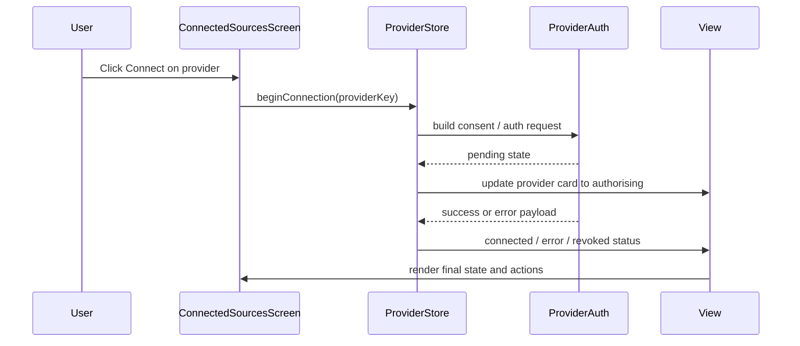

# [STORY-04] Connect My Health or Fitness Account - Implementation Planning

> **Source**: [docs/stories/04-connect-health-data-source.md](../stories/04-connect-health-data-source.md)
> **JIRA**: Not available — no JIRA CLI configured in this workspace. Story details supplied manually.
> **Workspace constraints** (from [Agents.md](../../Agents.md)): responsive website, **client-side only** (no backend), TypeScript, playful style with pastel colors, animations, and sounds for user actions and system reactions.

## User Story

**As a** runner,
**I want** to connect the app to Apple Health, Google Health/Fit, Fitbit, Garmin or Strava,
**so that** my runs are captured automatically without manual entry.

## Pre-conditions

- The app has an active dashboard and user-state persistence layer already established for the monthly goal and training plans.
- The runner can access a settings or sources area from the main dashboard without requiring a backend service.
- Supported providers are known and can be represented as a structured provider list with connection state and consent messaging.
- The app supports local persisted state so connected-provider status can survive refreshes in the same browser session.
- The MVP is intentionally client-side only, so the connection flow must be designed around browser-based auth UX and local token handling rather than server-side OAuth storage.
- The app already has a pattern for dialogs, cards, and success/error states that can be reused for the provider management experience.

## Design

### Visual Layout

The experience should feel like a trusted coach onboarding flow rather than a raw settings screen. It is a lightweight source-management panel with clear consent, connection states, and error handling.

1. **Connected sources screen**
   - A dedicated screen or sheet titled `Connected sources` sits within the app’s main navigation or settings workspace.
   - It lists each supported provider as a card with provider name, icon, current state, and action button.
   - Each card includes a small status indicator: `Connected`, `Disconnected`, `Needs attention`, or `Authorising`.
2. **Provider cards**
   - Each provider row has a concise summary: provider name, required data type, consent statement, and a small description of what will be imported.
   - The CTA changes dynamically: `Connect`, `Disconnect`, `Reconnect`, or `Retry` depending on the current connection state.
3. **Consent and status layer**
   - Before any auth flow begins, a consent message appears with provider-specific permissions and a clear explanation of why only activity/health scopes are requested.
   - A success or error banner sits above the list after the connection or disconnect action completes.
4. **Disconnect / removal path**
   - When disconnecting, the user sees a follow-up confirmation with the option to remove previously imported data from that source.
   - The action must be reversible and visually clear so the user knows whether future syncs continue or stop immediately.

### Color and Typography

- **Background Colors**:
  - Page: `bg-gradient-to-b from-pastel-mint via-pastel-sky to-pastel-lilac`
  - Card surfaces: `bg-white/80 backdrop-blur-sm`
  - Active/connected state: `bg-emerald-50 border border-emerald-200 text-emerald-700`
  - Warning/error state: `bg-rose-50 border border-rose-200 text-rose-700`
  - Idle/disconnected: `bg-slate-100 text-slate-600`
- **Typography**:
  - Screen headings: `font-display text-2xl font-bold text-slate-800`
  - Provider titles: `font-sans text-base font-semibold text-slate-800`
  - Body copy: `font-sans text-sm text-slate-600`
  - Buttons: `font-sans text-sm font-semibold`
- **Component-Specific**:
  - Provider cards: `rounded-3xl bg-white/80 shadow-soft ring-1 ring-slate-200`
  - Buttons: `rounded-full px-4 py-2.5 shadow-soft transition-all`
  - Status pill: `rounded-full px-2.5 py-1 text-xs font-medium`

### Interaction Patterns

- **Provider connection flow**:
  - Clicking `Connect` opens a consent modal or panel that summarises the requested access and the exact data categories to be imported.
  - The user confirms before the browser redirects to the provider or starts the auth simulation.
  - Loading states should disable the action and show a small spinner with `Authorising…` text.
- **Disconnect flow**:
  - A disconnect action triggers a confirmation dialog with an explicit toggle for deleting imported data from that provider.
  - Success or revocation states update the list immediately and provide clear recovery steps.
- **Error and retry UX**:
  - Failed authorisation or revoked access surfaces a friendly error card with a retry action and explanatory text.
  - The provider card remains visually distinct so the user understands why syncs are paused.
- **Accessibility**:
  - Every card, action, and consent state must be keyboard accessible.
  - Error banners should announce updates through `aria-live` regions and focus the user to the recovery action when appropriate.

### Measurements and Spacing

- **Container**:
  ```
  max-w-4xl mx-auto px-4 sm:px-6 lg:px-8
  ```
- **Component Spacing**:
  ```
  - Vertical rhythm: space-y-5
  - Grid gap: gap-4 md:gap-5
  - Card padding: p-4 md:p-5
  - Button stack: gap-3
  - Section margin: my-6
  ```

### Responsive Behavior

- **Desktop (lg: 1024px+)**:
  ```
  - Provider cards: grid-cols-2 gap-5
  - Consent panel: centered modal with max width 480px
  - Status summary visible inline with the list
  ```
- **Tablet (md: 768px - 1023px)**:
  ```
  - Provider cards: single column or 2-up depending on width
  - List remains easy to scan without overflow
  ```
- **Mobile (sm: < 768px)**:
  ```
  - Full-width cards
  - Consent and disconnect flows appear as bottom sheets or full-width dialogs
  - Primary actions remain sticky to the bottom of the view
  ```

## Technical Requirements

### Component Structure

```text
src/
├── features/
│   ├── goal/
│   │   ├── DashboardPage.tsx                     # Existing dashboard entry and sources link
│   │   └── _components/
│   │       ├── ConnectedSourcesScreen.tsx       # Screen listing all providers and state
│   │       ├── ProviderConnectionCard.tsx       # Individual provider card and statuses
│   │       ├── ProviderConsentDialog.tsx         # Consent UI before provider auth
│   │       ├── DisconnectProviderDialog.tsx     # Confirm disconnect and optional delete data
│   │       ├── ProviderErrorBanner.tsx           # Shared auth/revocation feedback
│   │       └── useProviderConnections.ts         # Connect/disconnect/auth state orchestration
│   └── health/
│       └── providerRegistry.ts                   # Supported provider definitions + scope metadata
├── store/
│   └── providerStore.ts                          # Local persisted state for connection state, tokens, and sync status
├── lib/
│   ├── providerAuth.ts                           # Provider auth helpers, mock flows, and scope validation
│   ├── providerStorage.ts                        # Secureish local persistence and revocation handling
│   └── validation.ts                             # Auth validation and error message helpers
├── types/
│   └── provider.ts                               # Provider types, consent model, and state enums
└── components/ui/
    ├── Button.tsx                                # Shared CTA styles
    ├── Dialog.tsx                                # Reused confirmation / consent modal
    └── FieldError.tsx                            # Shared error messaging
```

### Required Components

- ConnectedSourcesScreen ⬜
- ProviderConnectionCard ⬜
- ProviderConsentDialog ⬜
- DisconnectProviderDialog ⬜
- ProviderErrorBanner ⬜
- useProviderConnections ⬜
- providerRegistry ⬜
- providerStore ⬜
- providerAuth ⬜
- providerStorage ⬜
- provider types ⬜

### State Management Requirements

```typescript
export type ProviderKey = 'apple-health' | 'google-fit' | 'fitbit' | 'garmin' | 'strava';

export type ConnectionStatus = 'disconnected' | 'connecting' | 'connected' | 'error' | 'revoked';

export interface ProviderDefinition {
  key: ProviderKey;
  name: string;
  icon: string;
  authUrl?: string;
  scopes: string[];
  consentText: string;
  importedDataTypes: string[];
}

export interface ProviderConnectionState {
  providerKey: ProviderKey;
  status: ConnectionStatus;
  isConnected: boolean;
  token?: string;
  tokenExpiresAt?: string;
  lastSyncAt?: string;
  lastError?: string;
  importedDataCount?: number;
}

export interface ProviderState {
  connections: Record<ProviderKey, ProviderConnectionState>;
  activeAuthProvider?: ProviderKey;
  isHydrated: boolean;
}
```

```typescript
interface ProviderStoreState {
  connections: Record<ProviderKey, ProviderConnectionState>;
  connectProvider: (providerKey: ProviderKey, consentAccepted: boolean) => Promise<void>;
  disconnectProvider: (providerKey: ProviderKey, deleteImportedData: boolean) => Promise<void>;
  handleAuthCallback: (providerKey: ProviderKey, payload: { token?: string; error?: string }) => void;
  retryProvider: (providerKey: ProviderKey) => Promise<void>;
  resetProviderState: (providerKey: ProviderKey) => void;
}
```

The provider store should follow the app’s client-side persistence conventions and keep state serializable for easy testing. The auth orchestration should be modelled as a small, pure state machine so connection, disconnect, and revocation events can be tested without a network call.

## Acceptance Criteria

### Layout & Content

1. Header Section
   ```
   - A Connected sources screen is visible from the main app navigation or settings entry point.
   - The screen lists the supported providers and their current connection status.
   - Status and actions are readable at a glance without opening a separate page.
   ```

2. Main Content Area
   ```
   - Each provider is presented as a card with name, current state, and action.
   - Consent wording explains what access is requested and why it is necessary.
   - Error and success states are visible without hiding the underlying provider list.
   ```

3. Provider Management
   ```
   - A user can connect, disconnect, review, and retry providers from the same screen.
   - Provider cards clearly separate connected and disconnected states.
   - Actions are grouped and consistent across desktop and mobile layouts.
   ```

### Functionality

1. Provider connection and consent

   - [ ] The runner can view all supported providers and their current connection state.
   - [ ] A consent message is shown before the authorisation flow starts.
   - [ ] The app requests only the activity/health scopes required by that provider.
   - [ ] Clicking connect updates the provider to a loading/authorising state and then to connected or error.

2. Token and disconnect handling

   - [ ] Access tokens are stored in a secure local mechanism appropriate for a client-only app.
   - [ ] The runner can disconnect a provider at any time.
   - [ ] Disconnecting stops future syncing immediately.
   - [ ] The user is offered the option to delete previously imported data from that provider.

3. Revocation and errors

   - [ ] A clear error message appears when provider authorisation fails or is revoked.
   - [ ] The app retains a visible failure state that can be retried.
   - [ ] The provider card indicates when access is no longer valid and the runner should reconnect.

### Navigation Rules

- The Connected sources screen must be discoverable from the main runner dashboard or app settings without deep navigation confusion.
- The connect/disconnect actions must always return the user to the provider list with updated state.
- If auth fails, the user must remain on the same screen and be able to retry without losing the provider context.
- The disconnect confirmation should be explicit and not accidentally triggered by a single tap.

### Error Handling

- Authorisation failures should be caught and converted into a friendly message with a clear action such as `Retry` or `Reconnect`.
- Revoked or expired tokens should result in a `Needs attention` status and a path back to the consent flow.
- Deletion or disconnect actions should fail gracefully with visible messaging instead of silent errors.

## Modified Files

```text
src/
├── features/
│   ├── goal/
│   │   ├── DashboardPage.tsx ⬜
│   │   └── _components/
│   │       ├── ConnectedSourcesScreen.tsx ⬜
│   │       ├── ProviderConnectionCard.tsx ⬜
│   │       ├── ProviderConsentDialog.tsx ⬜
│   │       ├── DisconnectProviderDialog.tsx ⬜
│   │       ├── ProviderErrorBanner.tsx ⬜
│   │       └── useProviderConnections.ts ⬜
│   └── health/
│       └── providerRegistry.ts ⬜
├── store/
│   └── providerStore.ts ⬜
├── lib/
│   ├── providerAuth.ts ⬜
│   ├── providerStorage.ts ⬜
│   └── validation.ts ⬜
├── types/
│   └── provider.ts ⬜
└── components/ui/
    ├── Button.tsx ⬜
    ├── Dialog.tsx ⬜
    └── FieldError.tsx ⬜
```

## Status

🟩 COMPLETED

**Delivered in:** `index.html`, `style.css`, `app.core.js`, `app.domain.js`, `app.store.js`, `app.ui.core.js`
**Verified by:** tests.html (Providers and sync) + live-UI acceptance run
**Note:** Re-implemented in the dependency-free vanilla build per Agents.md; the React implementation under `src/` is retained for reference only. There is no backend and no OAuth — provider connection is a local simulation: the consent and scope screens are real UI, but no tokens exist and connect/disconnect/retry/revoke transitions are driven by a local state machine.

1. Setup & Configuration

   - [x] Confirm provider list and consent requirements
   - [x] Define local state schema and persistence approach
   - [x] Align provider UX with existing dashboard patterns

2. Layout Implementation

   - [x] Build Connected sources screen shell
   - [x] Add provider cards and animated status states
   - [x] Implement consent and disconnect modal flows

3. Feature Implementation

   - [x] Add provider registry and scope metadata
   - [x] Wire connection, disconnect, retry, and revocation logic
   - [x] Persist provider state and imported-data deletion preferences

4. Testing

   - [x] Verify connected/disconnected and loading states
   - [x] Validate error, retry, and revoked-token handling
   - [x] Check responsive layout and keyboard accessibility
   - [x] Review privacy/consent text and scope minimisation rules

## Dependencies

- Existing dashboard layout and local storage persistence patterns
- Shared Dialog and Button UI primitives
- Goal-related state structure for surfacing a `Connected sources` entry point
- Future import/aggregation stories for imported activity ingestion and data cleanup behaviour

## Related Stories

- [STORY-05] Import Run Activities and Metrics
- [STORY-06] Log Run Manually
- [STORY-07] Classify Run Versus Walk
- [STORY-11] View Monthly Goal Progress

## Notes

### Technical Considerations

1. Because this is a client-side application, the auth flow cannot rely on a backend token vault; the design must use browser-safe storage patterns and ethically state that real-world production storage would require a secure backend service.
2. The provider registry should model only activity/health permissions needed by the app and must not request broad access.
3. The app should treat connection state as explicit and serialisable so refreshes and rehydration remain predictable.
4. Revocation handling must be represented as a first-class status, not just a silent failure, so users know when to reconnect.
5. The imported-data deletion option should be retained in the disconnect flow even if the app does not yet import all provider data types.

### Business Requirements

- The runner should feel confident that only relevant activity data will be imported.
- Connection should be simple and trustworthy, with explicit consent before any auth begins.
- Users must be able to disconnect at any time and manage prior imports without confusion.
- The app should clearly explain what happens when a provider is revoked or becomes unavailable.

### API Integration

#### Type Definitions

```typescript
interface ProviderMetadata {
  key: string;
  name: string;
  scopes: string[];
  permissionLabel: string;
  status: 'connected' | 'disconnected' | 'error' | 'revoked';
}

interface ProviderAuthResponse {
  providerKey: string;
  token?: string;
  expiresAt?: string;
  error?: string;
  revoked?: boolean;
}

interface ProviderConnectionRecord {
  providerKey: string;
  connected: boolean;
  importedDataCount: number;
  lastSyncAt?: string;
  lastError?: string;
}
```

#### Mock Implementation

```typescript
// filepath: mocks/providerAuth.ts
const mockProviderState = {
  'apple-health': { connected: false, lastError: undefined },
  'google-fit': { connected: true, importedDataCount: 24 },
  fitbit: { connected: false },
  garmin: { connected: false },
  strava: { connected: false },
};
```

```json
// filepath: mocks/responses/providerConnections.json
{
  "status": "SUCCESS",
  "data": {
    "connections": [
      {
        "providerKey": "google-fit",
        "connected": true,
        "importedDataCount": 24,
        "lastSyncAt": "2026-09-21T08:30:00.000Z"
      },
      {
        "providerKey": "strava",
        "connected": false,
        "importedDataCount": 0
      }
    ]
  }
}
```

### State Management Flow



### Custom Hook Implementation

```typescript
const useProviderConnections = () => {
  const store = useProviderStore();

  const connectProvider = async (providerKey: string) => {
    store.setState({ activeAuthProvider: providerKey });
    try {
      const result = await authorizeProvider(providerKey);
      if (result.error) {
        store.handleAuthCallback(providerKey, { error: result.error });
        return;
      }
      store.handleAuthCallback(providerKey, { token: result.token });
    } catch (error) {
      store.handleAuthCallback(providerKey, { error: 'Authorisation failed. Please try again.' });
    }
  };

  return {
    connectProvider,
    disconnectProvider: store.disconnectProvider,
    connections: store.connections,
  };
};
```

## Testing Requirements

### Integration Tests (Target: 80% Coverage)

1. Core Functionality Tests

```typescript
describe('Provider connection flow', () => {
  it('should show consent before connecting a provider', async () => {
    // Assert consent modal renders and the auth flow is blocked until confirmation
  });

  it('should persist connected state after a successful auth result', async () => {
    // Verify connected status and token persistence
  });

  it('should show a retry path when authorisation fails', async () => {
    // Verify state moves to error and the user can retry
  });
});
```

2. Responsive Tests

```typescript
describe('Responsive behavior', () => {
  it('should render provider cards correctly on mobile', async () => {
    // Verify card stacking and action visibility on smaller viewports
  });

  it('should keep consent and disconnect dialogs usable on tablet and desktop', async () => {
    // Validate interaction patterns across breakpoints
  });
});
```

3. Edge Cases

```typescript
describe('Edge cases', () => {
  it('should handle missing tokens gracefully', async () => {
    // Ensure the app does not crash when provider auth returns no token
  });

  it('should handle revoked access without hiding the provider from the list', async () => {
    // Verify revocation state is visible and actionable
  });

  it('should avoid deleting imported data unless user explicitly confirms', async () => {
    // Ensure a confirmation gate prevents accidental data removal
  });
});
```

### Performance Tests

1. Event Performance

```typescript
describe('Performance', () => {
  it('should render the provider list efficiently with multiple states', async () => {
    // Validate UI updates remain responsive during auth events
  });

  it('should not duplicate a provider state after repeated actions', async () => {
    // Confirm idempotent connection/disconnect handling
  });
});
```

2. Resource Management

```typescript
describe('Resource Management', () => {
  it('should clean up auth-loading state after a timeout or cancellation', async () => {
    // Ensure the screen resets correctly when an auth workflow ends
  });

  it('should not leave stale tokens in memory after disconnect', async () => {
    // Verify the disconnect path clears stale auth state
  });
});
```

### Accessibility Tests

```typescript
describe('Accessibility', () => {
  it('should announce status changes and errors to screen readers', async () => {
    // Validate aria-live updates and user feedback
  });

  it('should ensure all interactive controls have clear labels', async () => {
    // Verify accessible names for connect/disconnect/retry actions
  });
});
```

## Feature Documentation

### Story Format

- Title: Feature - Connect health data source
- User Story
  - Clear description in the form “As a runner, I want to connect a health provider, so that my runs are captured automatically.”
- Pre-conditions
  - List of required app state, provider definitions, and client-side storage assumptions.
- Design
  - Provider list cards, consent flow, status banners, disconnect confirmations.
- Technical Requirements
  - Component structure and provider state schema.
  - Explicit notes about scope minimisation and storage decisions.
- Acceptance Criteria
  - Layout and content requirements.
  - Connection, disconnect, and revocation behaviour.
- Modified Files
  - Provider UI, store, auth helpers, and type definitions.
- Status
  - Overall status and implementation tasks.
- Dependencies
  - Dashboard, local storage, future import ingestion stories.
- Related Stories
  - Import run activities and metrics; manual log; classification.
- Notes
  - Data privacy, client-only constraints, and future work.
