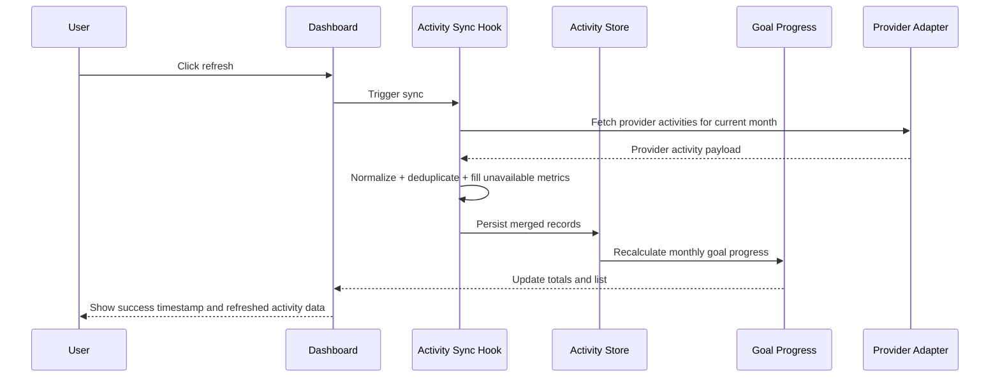

# [STORY-05] Import My Run Activities and Metrics - Implementation Planning

> **Source**: [docs/stories/05-import-run-activities-and-metrics.md](../stories/05-import-run-activities-and-metrics.md)
> **JIRA**: Not available — no JIRA CLI configured in this workspace. Story details supplied manually.
> **Workspace constraints** (from [Agents.md](../../Agents.md)): responsive website, client-side only, TypeScript, playful pastel UI, lightweight animations, and sound feedback for user actions and system reactions.

## User Story

**As a** runner,
**I want** my activities and their metrics imported from my connected source,
**so that** my progress reflects what I actually ran without me typing anything in.

## Pre-conditions

- The project is a Vite + React + TypeScript single-page app with local persistence in browser storage.
- A connected health data source exists or is being configured via the earlier story flow; this story assumes one or more providers can be connected and queried.
- The monthly goal feature is already in place and the dashboard is able to display a current month goal and aggregate progress.
- Activities are currently entered manually or are absent; the app must support imported activity records without requiring manual input.
- The app needs a single normalized activity model that can represent provider-specific values and missing metrics without losing reliability.
- Historical data for the active goal month must be imported when the source is connected or refreshed.

## Design

### Visual Layout

The feature belongs on the dashboard beneath the goal summary and above the weekly/monthly progress surfaces. The design should feel consistent with the project’s playful, pastel brand language while communicating trust, syncing, and data provenance.

1. **Connected source summary panel**
   - Shows a list of connected providers (for example: Apple Health, Google Fit, Garmin, Strava).
   - Each provider row includes a status dot, provider name, and a small “Last synced” text.
   - A primary action button triggers a manual refresh.
   - A muted state communicates when a provider is connected but never synced, or when sync is currently running.

2. **Activity import section**
   - Displays imported activities in a compact list with date/time and title (or source label).
   - Each row includes distance, duration, and pace when available.
   - A small metrics chip area allows the app to surface optional fields such as average speed, stride length, and elevation gain.
   - Rows are grouped by day or ordered descending by date, making historical imports easy to scan.

3. **Data quality indicators**
   - Missing metrics are marked as “Unavailable” instead of 0 to avoid false precision.
   - Rows can show a muted badge for “Imported” and, if deduplicated, “Merged” or “Duplicate removed”.

4. **Goal progress integration**
   - The imported activity list is not isolated; it contributes to the total distance for the active month and updates the dashboard summary immediately after sync.
   - The user sees a clear confirmation that the refresh succeeded and when it last succeeded.

### Color and Typography

- **Background Colors**:
  - Page: `bg-gradient-to-b from-pastel-mint via-pastel-sky to-pastel-lilac`
  - Panel surface: `bg-white/80 backdrop-blur-sm`
  - Provider success/accent: `bg-emerald-100 text-emerald-700`
  - Alert / missing metric: `bg-slate-100 text-slate-500`
  - Primary refresh action: `bg-pastel-coral hover:bg-pastel-coral-dark`

- **Typography**:
  - Section heading: `font-display text-xl font-semibold text-slate-800`
  - Activity date: `font-sans text-sm text-slate-500`
  - Metric values: `font-sans text-base font-medium text-slate-700`
  - Small unavailability text: `font-sans text-xs uppercase tracking-wide text-slate-400`

- **Component-Specific**:
  - Cards: `rounded-3xl bg-white/80 shadow-soft ring-1 ring-white/60`
  - Provider rows: `rounded-2xl border border-slate-200 bg-slate-50/80`
  - Buttons: `rounded-full px-4 py-2.5 font-semibold text-white`
  - Metric chips: `rounded-full bg-slate-100 px-2 py-1 text-xs`

### Interaction Patterns

- **Manual refresh**:
  - Clicking the refresh button triggers a loading state and disables the control.
  - A spinner or pulsing dot appears while the import executes.
  - If refresh completes successfully, a success tone plays and the timestamp updates.
  - If it fails, an inline error state explains that the sync could not complete and a retry action remains available.

- **Import result feedback**:
  - New imported activities animate into the list with a subtle fade-up.
  - Success states are visible in both the provider row and the overall activity collection.
  - Missing metrics are clearly rendered as unavailable rather than zero, reducing false assumptions.

- **Form / status interactions**:
  - Focus rings and hover states follow the project’s standard accessible button patterns.
  - The sync action should be keyboard accessible and maintain visible focus states.

### Measurements and Spacing

- **Container**:
  ```
  max-w-5xl mx-auto px-4 sm:px-6 lg:px-8
  ```

- **Component Spacing**:
  ```
  - Vertical rhythm: space-y-6
  - Row gap: gap-3 md:gap-4
  - Section padding: py-8 md:py-10
  - Card padding: p-4 md:p-6
  ```

### Responsive Behavior

- **Desktop (lg: 1024px+)**:
  - Activity list and source panel sit side-by-side or stacked depending on dashboard density.
  - Provider rows are full-width and left-aligned.
- **Tablet (md: 768px - 1023px)**:
  - Source summary remains visible above the activity list.
  - Metric data wraps cleanly within a card width.
- **Mobile (sm: < 768px)**:
  - Panels stack vertically.
  - Actions collapse to full-width buttons when needed.
  - Date and metric rows shift to a compact two-line layout for readability.

## Technical Requirements

### Component Structure

```text
src/
├── features/goal/
│   ├── DashboardPage.tsx                    # Goal dashboard with activity and sync panel
│   └── _components/
│       ├── ActivityList.tsx                 # Imported activities list
│       ├── ActivityItem.tsx                 # Individual activity row with metrics
│       ├── ConnectedSourcesPanel.tsx        # Provider status and last sync timestamp
│       ├── SyncStatusBar.tsx                # Success / failure / in-progress UI
│       ├── MetricValue.tsx                  # Displays value or unavailable
│       ├── useActivitySync.ts               # Fetch import orchestration + dedupe + store update
│       └── useGoalProgress.ts               # Aggregates imported activity into month goal progress
├── store/
│   ├── activityStore.ts                     # Imported activities + sync metadata
│   ├── goalStore.ts                         # Existing goal data integration
│   └── settingsStore.ts                     # Existing sound / preference values
├── types/
│   ├── activity.ts                          # ImportedActivity, ProviderStatus, SyncSnapshot
│   └── goal.ts                              # Goal integration types
├── lib/
│   ├── activityImport.ts                    # Normalization + de-duping logic
│   ├── metrics.ts                           # Unavailable / formatting helpers
│   ├── distance.ts                          # Reuse existing goal distance formatting
│   └── time.ts                              # Date + pace parsing helpers
├── hooks/
│   └── useSound.ts                          # Existing feedback hook, used for refresh success/failure
└── test/
    └── activityImport.test.ts               # Import, dedupe, and metric normalization tests
```

### Required Components

- DashboardPage ⬜
- ActivityList ⬜
- ActivityItem ⬜
- ConnectedSourcesPanel ⬜
- SyncStatusBar ⬜
- MetricValue ⬜
- useActivitySync ⬜
- useGoalProgress ⬜
- activityStore ⬜
- activityImport utils ⬜

### State Management Requirements

```typescript
interface ProviderConnection {
  id: string;
  name: string;
  connected: boolean;
  lastSyncedAt?: string;
  lastSyncStatus: 'idle' | 'syncing' | 'success' | 'error';
}

interface ImportedActivity {
  id: string;
  sourceId: string;
  externalActivityId: string;
  occurredAt: string;
  distanceKm?: number;
  durationSeconds?: number;
  paceMinPerKm?: number;
  averageSpeedKmh?: number;
  strideLengthM?: number;
  elevationGainM?: number;
  title?: string;
  raw: Record<string, unknown>;
}

interface ActivityStoreState {
  activities: ImportedActivity[];
  providers: ProviderConnection[];
  lastSuccessfulSyncAt?: string;
  isRefreshing: boolean;
  error?: string;
}

interface ActivityStoreActions {
  refreshActivities: () => Promise<void>;
  hydrateFromStorage: () => void;
  mergeImportedActivities: (items: ImportedActivity[]) => void;
  markProviderSyncStatus: (providerId: string, status: ProviderConnection['lastSyncStatus']) => void;
}
```

## Acceptance Criteria

### Layout & Content

1. Dashboard section for connected sources
   - [ ] At least one provider can be displayed as connected and active in the app.
   - [ ] A manual refresh action is clearly visible.
   - [ ] The last successful sync time is shown in human-readable format.

2. Imported activity list
   - [ ] Activity records appear in the activity list after a successful import.
   - [ ] Each item retains date/time, distance, and duration information in a consistent structure.
   - [ ] Missing metrics render as “Unavailable” and do not appear as zero-valued numbers.

3. Goal integration
   - [ ] Imported activities update the current month’s total distance and progress display.
   - [ ] Historical activities for the current goal month are included in the imported set.

### Functionality

1. Data import and sync
   - [ ] Activities are imported from each connected provider.
   - [ ] Historical activities for the active month are included when available.
   - [ ] The app tracks the last successful sync timestamp and updates it after successful refreshes.

2. Data normalization and quality
   - [ ] Distance, duration, pace, average speed, stride length, elevation gain, and date/time are stored when supplied by the provider.
   - [ ] Values not supplied by the provider are marked as unavailable rather than zero.
   - [ ] Imported data is normalized to the app’s canonical unit/time model.

3. Deduplication and accuracy
   - [ ] The same activity captured by multiple connected providers is deduplicated into one stored item.
   - [ ] Duplicate detection is stable across re-syncs and rehydration.
   - [ ] Goal progress is not double-counted when the same run is imported twice.

4. Manual refresh / user drive
   - [ ] Users can trigger a manual refresh of provider data.
   - [ ] Refresh feedback remains visible while import occurs.
   - [ ] Successful refresh results in a clear update to the UI and timestamp.

### Navigation Rules

- Import and refresh actions must remain available without navigating away from the dashboard.
- Activity import must not overwrite manually typed runs unless they are a duplicate of the same external source event.
- The dashboard must always show a meaningful empty state when no activities have been imported yet.

### Error Handling

- When a provider fails to sync, the app should show a non-blocking error state instead of crashing the dashboard.
- Empty or partial provider responses should be treated as valid data with missing metrics marked as unavailable.
- Network or storage access failure should preserve previously imported activity data rather than clearing the list.

## Modified Files

```text
src/
├── features/goal/
│   ├── DashboardPage.tsx ⬜
│   └── _components/
│       ├── ActivityList.tsx ⬜
│       ├── ActivityItem.tsx ⬜
│       ├── ConnectedSourcesPanel.tsx ⬜
│       ├── SyncStatusBar.tsx ⬜
│       ├── MetricValue.tsx ⬜
│       ├── useActivitySync.ts ⬜
│       └── useGoalProgress.ts ⬜
├── store/
│   ├── activityStore.ts ⬜
│   └── goalStore.ts ⬜
├── types/
│   ├── activity.ts ⬜
│   └── goal.ts ⬜
├── lib/
│   ├── activityImport.ts ⬜
│   ├── metrics.ts ⬜
│   └── time.ts ⬜
└── test/
    └── activityImport.test.ts ⬜
```

## Status

🟩 COMPLETED

**Delivered in:** `index.html`, `style.css`, `app.core.js`, `app.domain.js`, `app.store.js`, `app.ui.core.js`
**Verified by:** tests.html (Providers and sync, De-duplication) + live-UI acceptance run
**Note:** Re-implemented in the dependency-free vanilla build per Agents.md; the React implementation under `src/` is retained for reference only. There is no backend, so sync is a local simulation — a deterministic seeded feed per month in which providers report overlapping subsets of the same sessions, so normalisation, missing-metric handling and cross-provider de-duplication behave as they would against real sources.

1. Setup & Configuration
   - [x] Confirm provider data model and normalized activity schema
   - [x] Extend the dashboard to accommodate sync UI and imported activity list
   - [x] Define local persistence shape for sync metadata and imported records

2. Layout Implementation
   - [x] Add connected-provider summary panel and refresh controls
   - [x] Add activity list row patterns and metric rendering
   - [x] Add unavailable-data presentation and empty-state handling

3. Feature Implementation
   - [x] Implement provider import orchestration and history fetch flow
   - [x] Normalize provider payloads into the app’s canonical activity format
   - [x] Implement de-duplication across connected providers
   - [x] Wire imported activities into goal progress aggregation

4. Testing
   - [x] Unit tests for provider normalization and metric fallback rules
   - [x] Deduplication regression tests for multi-provider overlap
   - [x] Dashboard test for activity list rendering and progress updates
   - [x] Manual refresh and last-sync timestamp validation

## Dependencies

- Story 04: Connect Health Data Source
- Existing goal dashboard and local storage persistence model
- Existing unit conversion helpers for distance and pace display
- Existing motion and sound hooks for live UI feedback

## Related Stories

- [STORY-04] Connect My Health Data Source
- [STORY-01] Create a Monthly Running Distance Goal
- [STORY-02] Generate a Systematic Training Plan

## Notes

### Technical Considerations

1. The app is client-side only; provider access must be abstracted behind safe local simulation or mocked fetch layers until a real source integration is ready.
2. Imported records must remain normalized to avoid drift between provider-specific naming and the app’s internal model.
3. Deduplication should be based on stable keys rather than UI labels, especially when the same run is sourced from multiple providers.
4. Missing metrics should never be silently converted into zero because that would distort calculations and confidence in progress reporting.
5. Activity store hydration must respect existing user data and avoid re-importing duplicates after a refresh.

### Business Requirements

- The runner should not have to manually re-enter runs that are already captured upstream.
- Progress reporting must reflect real training activity, not guessed or approximated totals.
- The app must remain understandable when some metrics are absent from a provider payload.
- Trust and transparency are critical: the user must know that data is imported, when it last synced, and what is missing.

### API Integration

#### Type Definitions

```typescript
interface ProviderSyncResult {
  providerId: string;
  activities: ImportedActivity[];
  syncedAt: string;
  status: 'success' | 'partial' | 'error';
}

interface ProviderAdapter {
  id: string;
  name: string;
  connect(): Promise<void>;
  fetchActivities(options: { monthKey: string }): Promise<ImportedActivity[]>;
}

interface ActivityQuery {
  monthKey: string;
  providerIds?: string[];
}
```

### Mock Implementation

#### Mock Provider Response

```typescript
const mockSyncResponse = {
  providerId: 'apple-health',
  syncedAt: '2026-09-21T08:00:00.000Z',
  activities: [
    {
      id: 'apple-101',
      sourceId: 'apple-health',
      externalActivityId: 'run-123',
      occurredAt: '2026-09-18T06:42:00Z',
      distanceKm: 8.4,
      durationSeconds: 2540,
      paceMinPerKm: 5.08,
      averageSpeedKmh: 11.9,
      strideLengthM: 1.08,
      elevationGainM: 62,
      title: 'Morning run',
      raw: {},
    },
  ],
};
```

### State Management Flow



### Custom Hook Implementation

```typescript
const useActivitySync = () => {
  const store = useActivityStore();

  const refresh = async () => {
    store.setState({ isRefreshing: true, error: undefined });

    try {
      const results = await Promise.all(
        store.providers
          .filter((provider) => provider.connected)
          .map((provider) => providerAdapterMap[provider.id].fetchActivities({ monthKey: getCurrentMonthKey() })),
      );

      const merged = mergeActivities(results.flat());
      store.mergeImportedActivities(merged);
      store.setState({
        lastSuccessfulSyncAt: new Date().toISOString(),
        isRefreshing: false,
      });
    } catch (error) {
      store.setState({
        isRefreshing: false,
        error: 'The last sync could not be completed. Please try again.',
      });
    }
  };

  return { refresh, isRefreshing: store.isRefreshing, error: store.error };
};
```

## Testing Requirements

### Integration Tests (Target: 80% Coverage)

1. Core Functionality Tests

```typescript
describe('Activity import', () => {
  it('imports historical activities for the active month', async () => {
    // Arrange provider payload and month key
    // Assert the records are added to the store
  });

  it('updates goal progress when imported data is added', async () => {
    // Arrange a goal and imported activity list
    // Assert the distance total changes appropriately
  });

  it('marks missing metric values as unavailable', async () => {
    // Provider omits stride length / elevation gain
    // Assert the UI renders unavailable instead of 0
  });
});
```

2. Dedupe and refresh tests

```typescript
describe('Deduplication', () => {
  it('merges duplicate activities recorded by multiple providers', async () => {
    // Same run present from Strava and Apple Health
    // Assert only one stored record remains
  });

  it('updates the last successful sync timestamp after a refresh', async () => {
    // Trigger sync and assert timestamp changes
  });
});
```

3. Edge Cases

```typescript
describe('Edge cases', () => {
  it('handles empty provider responses gracefully', async () => {
    // Assert no crash and empty state remains stable
  });

  it('handles partial provider payloads without zero values', async () => {
    // Assert partial metrics are retained and missing ones are flagged as unavailable
  });
});
```

### Accessibility Tests

```typescript
describe('Accessibility', () => {
  it('renders refresh controls with accessible labels and focus states', async () => {
    // Assert keyboard access and focus styling
  });

  it('announces sync success or failure to assistive technology', async () => {
    // Assert aria-live region or equivalent feedback
  });
});
```

### Performance Tests

- Refresh should remain responsive even when multiple providers return a large historical dataset.
- Duplicate detection should use efficient keys rather than naive nested array scanning.
- Rendering for a large activity list should avoid unnecessary re-renders.

## Feature Documentation

### Story Format

- Title: Feature - Import my run activities and metrics
- User Story
  - As a runner, I want my activities and metrics imported from a connected source so my progress reflects what I actually ran.
- Pre-conditions
  - Goal model and dashboard exist
  - Provider connection or mock data flow exists
  - Local storage persists source and activity state
- Design
  - Provider summary panel, activity list, sync status, and unavailable metric handling
- Technical Requirements
  - Normalized activity schema, deduplication strategy, provider sync flow, progress aggregation
- Acceptance Criteria
  - Historical import, metric quality, dedupe, manual refresh, and goal integration
- Modified Files
  - Activity-related store, types, component, and util files
- Status
  - Implemented against a deterministic local provider feed; there is no backend, so real OAuth integration remains out of scope by design
- Dependencies
  - Health data connect story and goal summary/persistence
- Related Stories
  - Story 04 and Story 01
- Notes
  - Client-side only, no backend, dedupe logic, unavailable metric semantics
