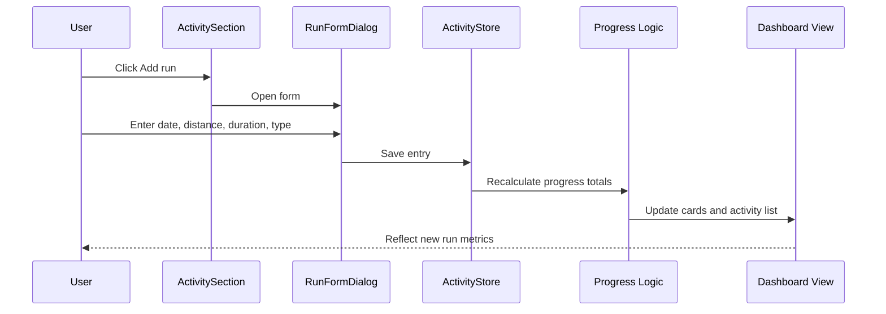

# [STORY-06] Log a Run Manually - Implementation Planning

> **Source**: [docs/stories/06-log-run-manually.md](../stories/06-log-run-manually.md)
> **JIRA**: STORY-06
> **Workspace constraints** (from [Agents.md](../../Agents.md)): responsive website, client-side only, TypeScript, playful pastel UX with animations and sound cues.

## User Story

**As a** runner without a connected device,
**I want** to enter a run manually,
**so that** I can still use the app and keep my plan progress accurate.

## Pre-conditions

- The app already supports monthly goal setup and training-plan generation using local browser persistence.
- User data is stored entirely in the browser via Zustand + `localStorage` and should remain consistent with the current store patterns.
- The dashboard already presents goal summary information and a run-related section can be added without breaking the existing layout.
- There is no current log-run workflow, imported activity list, or manual-entry data model yet.
- The UI should remain mobile-first and accessible while supporting quick entry on a phone.

## Design

### Visual Layout

The manual run flow fits into the existing dashboard experience as a new activity section beneath the monthly goal and training-plan area.

1. **Dashboard activity panel**
   - Shows a compact header: “Recent activity” or “Runs” with an action button such as “Add run”.
   - Displays a list of activity entries sorted by date descending.
   - Empty state includes a helpful CTA for first-time users: “Log your first run”.
2. **Manual run form dialog**
   - Centered modal on desktop, bottom-sheet on mobile.
   - Fields stacked vertically: date, distance, duration, activity type.
   - Save controls appear in the footer with secondary cancel and primary save action.
3. **Activity row / list item**
   - Each row includes date, activity type badge, distance, duration, pace and average speed.
   - A manual indicator (`Manual`) is displayed for entries created without an external device.
   - Inline action controls allow edit or delete when the row is in focus or on tap.

### Color and Typography

- **Background Colors**:
  - Page: `bg-gradient-to-b from-pastel-mint via-pastel-sky to-pastel-lilac`
  - Cards: `bg-white/80` with `shadow-soft` and `ring-1 ring-white/60`
  - Accent: `bg-pastel-coral hover:bg-pastel-coral-dark`
  - Muted action: `bg-slate-100 text-slate-700`
- **Typography**:
  - Headings: `font-display text-xl md:text-2xl font-bold text-slate-800`
  - Body: `font-sans text-sm md:text-base text-slate-600`
  - Metric labels: `text-xs uppercase tracking-[0.2em] text-slate-500`
  - Numbers: `font-display text-lg md:text-xl font-bold text-slate-800`
- **Component-Specific**:
  - Cards: `rounded-2xl bg-white/80 shadow-soft`
  - Buttons: `rounded-full px-4 py-2.5 font-semibold`
  - Inputs: `rounded-2xl border-2 border-slate-200 focus:border-pastel-sky-dark focus:ring-4 focus:ring-pastel-sky/40`

### Interaction Patterns

- **Primary button interaction**:
  - Hover: slight background darken and scale-up transition.
  - Click: compressed press animation; emit a soft `pop` sound.
  - Disabled state while saving; avoid duplicate submit calls.
- **Form field interaction**:
  - Focused field shows ring highlight and field validation helper appears inline.
  - Validation errors should be clear and immediately visible for distance, duration, and activity date.
  - Save success produces a subtle success feedback and resets the form.
- **List action interaction**:
  - Edit opens the same modal in update mode.
  - Delete triggers confirmation; action should be explicit and reversible.

### Measurements and Spacing

- **Container**:
  ```
  max-w-3xl mx-auto px-4 sm:px-6 lg:px-8
  ```
- **Component Spacing**:
  ```
  - Vertical rhythm: space-y-4 md:space-y-6
  - Form gaps: gap-4
  - Card padding: p-4 md:p-6
  - Section spacing: py-4 md:py-6
  ```

### Responsive Behavior

- **Desktop (lg: 1024px+)**:
  ```
  - Form: modal centered with max-w-md
  - Activity list: single column card stack
  - Actions: inline buttons in row
  ```
- **Tablet (md: 768px - 1023px)**:
  ```
  - List remains stacked
  - Form field labels align left with helper text below
  ```
- **Mobile (sm: < 768px)**:
  ```
  - Add run opens as bottom sheet
  - Fields stack vertically with full-width buttons
  - Action row becomes a split layout with small button sizes
  ```

## Technical Requirements

### Component Structure

```
src/
├── features/
│   ├── goal/
│   │   └── DashboardPage.tsx                 # Existing dashboard shell
│   └── activity/
│       ├── ActivitySection.tsx               # Lists runs and provides add action
│       ├── ActivityList.tsx                  # Renders date-sorted run entries
│       ├── ActivityItem.tsx                  # Row-level item; manual badge + actions
│       ├── RunFormDialog.tsx                 # Create/edit manual run form
│       ├── RunTypeSelector.tsx               # Activity type choice UI
│       ├── useRunForm.ts                     # Form validation + submission logic
│       └── activities.test.tsx               # Feature-level integration tests
├── store/
│   ├── goalStore.ts                          # Existing month-based goal records
│   ├── activityStore.ts                      # New run log persistence store
│   └── settingsStore.ts                      # Existing sound/unit settings
├── types/
│   ├── goal.ts                               # Existing goal types
│   └── activity.ts                           # Activity types + run metrics model
├── lib/
│   ├── distance.ts                           # Existing conversion helpers
│   ├── duration.ts                           # Duration parsing / formatting helpers
│   ├── pace.ts                               # Pace and speed calculations
│   └── validation.ts                         # Input validation rules
├── components/ui/
│   ├── Button.tsx                            # Existing shared control
│   ├── Dialog.tsx                            # Existing modal wrapper
│   └── ConfirmDialog.tsx                     # Existing delete confirm flow
└── test/
    └── setup.ts
```

### Required Components

- ActivitySection ⬜
- ActivityList ⬜
- ActivityItem ⬜
- RunFormDialog ⬜
- RunTypeSelector ⬜
- useRunForm ⬜
- activityStore ⬜
- activity.ts types ⬜
- pace.ts / duration.ts helpers ⬜

### State Management Requirements

```typescript
export type ActivityType = 'run' | 'walk' | 'hike' | 'other';
export type SourceType = 'manual' | 'imported';

export interface RunEntry {
  id: string;
  date: string; // ISO date (YYYY-MM-DD)
  activityType: ActivityType;
  distance: number;
  distanceUnit: 'km' | 'mi';
  durationMinutes: number;
  source: SourceType;
  paceMinutesPerKm: number | null;
  averageSpeedKmh: number | null;
  createdAt: string;
  updatedAt: string;
}

interface ActivityStoreState {
  entries: RunEntry[];
  hydrated: boolean;
  addEntry: (input: RunFormInput) => RunEntry;
  updateEntry: (id: string, patch: Partial<RunFormInput>) => RunEntry | undefined;
  deleteEntry: (id: string) => void;
  getEntriesForMonth: (monthKey: string) => RunEntry[];
}
```

The state should preserve ordering and calculate derived values in a deterministic way so that manual runs are treated the same as imported runs for progress calculations.

## Acceptance Criteria

### Layout & Content

1. Header Section
   ```
   - Activity panel should sit beneath the current goal/training content
   - Add action is visible and accessible on both empty and populated states
   - Mobile layout keeps controls thumb-friendly and uncluttered
   ```

2. Main Content Area
   ```
   - Empty state shows clear CTA when no runs exist
   - Populated state shows date-ordered run entries with summary details
   - Manual rows are visually identified with a 'Manual' label
   ```

3. Run Form Dialog
   ```
   - Fields: date, distance, duration, activity type
   - Pace and average speed update automatically based on user input
   - Save action persists entry and closes the modal
   ```

### Functionality

1. Manual run entry
   - [ ] User can add a run by entering date, distance, duration, and activity type.
   - [ ] Distance and duration validation prevents invalid or empty values.
   - [ ] The system calculates pace and average speed automatically.

2. Progress integration
   - [ ] Manual entries count toward daily, weekly, and monthly progress the same as imported runs.
   - [ ] Entries are included in the same aggregation logic as other run sources.
   - [ ] Existing goal/training summaries reflect the new run without separate logic paths.

3. Activity list behavior
   - [ ] Manual entries are marked visually as manual in the activity list.
   - [ ] User can edit a manual entry from the row or its form state.
   - [ ] User can delete a manual entry with confirmation.

4. Error handling
   - [ ] Validation failures show targeted inline feedback without breaking the UI.
   - [ ] Empty or corrupt stored activity data does not crash the app.
   - [ ] Failed save attempts keep the form interactive and actionable.

### Navigation Rules

- The add-run action should be available from the dashboard’s activity section without leaving the page.
- Editing a run must open the same form in update mode with the existing values prefilled.
- Delete actions should require explicit confirmation before removing a run.

### Error Handling

- Invalid distance values show a clear message and retain the user input.
- Non-numeric or missing duration values are rejected before save.
- If storage hydration fails, the app should recover gracefully and continue with an empty activity list.

## Modified Files

```
src/
├── features/
│   ├── goal/DashboardPage.tsx ⬜
│   └── activity/
│       ├── ActivitySection.tsx ⬜
│       ├── ActivityList.tsx ⬜
│       ├── ActivityItem.tsx ⬜
│       ├── RunFormDialog.tsx ⬜
│       ├── RunTypeSelector.tsx ⬜
│       ├── useRunForm.ts ⬜
│       └── activities.test.tsx ⬜
├── store/
│   ├── activityStore.ts ⬜
│   └── goalStore.ts ⬜
├── types/
│   ├── activity.ts ⬜
│   └── goal.ts ⬜
├── lib/
│   ├── pace.ts ⬜
│   ├── duration.ts ⬜
│   └── validation.ts ⬜
└── components/ui/
    └── Dialog.tsx ⬜
```

## Status

🟩 COMPLETED

**Delivered in:** `index.html`, `style.css`, `app.core.js`, `app.domain.js`, `app.store.js`, `app.ui.core.js`
**Verified by:** tests.html (Activity validation, Progress aggregation) + live-UI acceptance run
**Note:** Re-implemented in the dependency-free vanilla build per Agents.md; the React implementation under `src/` is retained for reference only. Manual entries share the single activity model with imported ones, so pace and average speed stay derived and daily/weekly/monthly totals update from one source of truth.

1. Setup & Configuration
   - [x] Confirm manual-run state model and existing data sources.
   - [x] Define the run-entry schema and validated field rules.
   - [x] Add the new activity section into the dashboard shell.

2. Layout Implementation
   - [x] Build empty and populated activity card states.
   - [x] Implement responsive run form modal and mobile bottom sheet.
   - [x] Add manual badges and per-item action controls.

3. Feature Implementation
   - [x] Add create/update/delete flows in the activity store.
   - [x] Calculate pace and average speed from distance and duration.
   - [x] Ensure manual entries participate in daily/weekly/monthly progress logic.

4. Testing
   - [x] Verify valid manual-run creation and validation errors.
   - [x] Verify edit/delete flows and list ordering.
   - [x] Verify progress totals update with manual entries.
   - [x] Verify accessibility and keyboard support for form actions.

## Dependencies

- Existing goal summary and dashboard shell in [src/features/goal/DashboardPage.tsx](../../src/features/goal/DashboardPage.tsx)
- Shared modal patterns from [src/components/ui/Dialog.tsx](../../src/components/ui/Dialog.tsx)
- Persistence conventions established in [src/store/goalStore.ts](../../src/store/goalStore.ts)
- Distance/validation utilities in [src/lib/distance.ts](../../src/lib/distance.ts) and [src/lib/validation.ts](../../src/lib/validation.ts)
- UI/button behaviors from [src/components/ui/Button.tsx](../../src/components/ui/Button.tsx)

## Related Stories

- [STORY-01] Create a Monthly Running Distance Goal
- [STORY-02] Generate a Systematic Training Plan
- [STORY-03] Customise Run Plan Schedule
- [STORY-05] Import Run Activities and Metrics

## Notes

### Technical Considerations

1. The feature should use a single source of truth for activity data so that manual runs and imported runs can share the same progress aggregation logic.
2. Pace and average speed should be derived values rather than stored independently to avoid drift when distance or duration changes.
3. The `date` field should be normalized to a stable ISO format to support sorting and monthly grouping.
4. The form should limit user input to realistic running values while still accepting common decimals and time formats.
5. The app must maintain the current lightweight, client-only architecture and avoid introducing unnecessary backend or network dependencies.

### Business Requirements

- This is a critical MVP fallback for runners without connected hardware.
- Manual logging must feel fast and frictionless to support on-device mobile use.
- The app should minimize user confusion by making manual entries indistinguishable from imported entries in progress calculations.
- The experience must remain playful and encouraging without compromising data accuracy.

### API Integration

No API layer is required for the MVP. All manual-run data is kept in local storage and processed by the client. The only “integration” is the existing local persistence ecosystem and the app’s current goal/progress logic.

#### Type Definitions

```typescript
interface RunFormInput {
  date: string;
  distance: number;
  durationMinutes: number;
  activityType: ActivityType;
  source: 'manual';
}

interface ActivitySummary {
  totalDistance: number;
  totalDurationMinutes: number;
  totalRuns: number;
  monthKey: string;
}
```

### State Management Flow



### Custom Hook Implementation

```typescript
const useRunForm = () => {
  const [values, setValues] = useState({
    date: new Date().toISOString().slice(0, 10),
    distance: '',
    durationMinutes: '',
    activityType: 'run',
  });

  const [errors, setErrors] = useState<Record<string, string>>({});

  const validate = () => {
    const nextErrors: Record<string, string> = {};

    if (!values.date) nextErrors.date = 'Please select a date.';
    if (!values.distance || Number(values.distance) <= 0) {
      nextErrors.distance = 'Distance must be greater than zero.';
    }
    if (!values.durationMinutes || Number(values.durationMinutes) <= 0) {
      nextErrors.durationMinutes = 'Duration must be greater than zero.';
    }

    setErrors(nextErrors);
    return Object.keys(nextErrors).length === 0;
  };

  return { values, errors, validate, setValues };
};
```

## Testing Requirements

### Integration Tests (Target: 80% Coverage)

1. Core Functionality Tests
   ```typescript
   describe('Manual run logging', () => {
     it('adds a run with calculated pace and speed', async () => {
       // Enter valid manual data and assert derived metrics
     });

     it('updates daily and monthly totals when a manual run is saved', async () => {
       // Confirm aggregated progress reflects the new run
     });

     it('allows editing and deleting a manual entry', async () => {
       // Validate update and delete flows
     });
   });
   ```

2. Responsive Tests
   ```typescript
   describe('Responsive behavior', () => {
     it('opens the form in a bottom sheet on mobile', async () => {
       // Assert mobile-specific UI behavior
     });

     it('keeps the activity list readable on tablet and desktop', async () => {
       // Assert responsive layout rules
     });
   });
   ```

3. Edge Cases
   ```typescript
   describe('Edge cases', () => {
     it('rejects invalid distance or duration values', async () => {
       // Assert form validation rules
     });

     it('handles empty or stale stored data without crashing', async () => {
       // Validate storage resilience
     });
   });
   ```

### Accessibility Tests

```typescript
describe('Accessibility', () => {
  it('keeps the run form keyboard accessible', async () => {
    // Tab navigation and Enter/Space actions
  });

  it('announces validation errors to assistive tech', async () => {
    // ARIA live region and labels
  });
});
```

## Feature Documentation

### Story Format

- Title: Feature - Manual Run Entry
- User Story
  - As a runner without a connected device, I want to enter a run manually, so that I can still use the app and keep my plan progress accurate.
- Pre-conditions
  - Goal and training-plan flows already exist.
  - The app persists user data locally.
  - Activity data does not yet exist.
- Design
  - Dashboard activity card with positive empty and populated states.
  - Modal form with validated date/distance/duration/activity inputs.
- Technical Requirements
  - New activity domain model and store.
  - Derived pace/speed helpers.
  - Manual entry integration into progress calculations.
- Acceptance Criteria
  - Manual entry save, validation, editing, and deleting.
  - Progress integration and visual manual marker.
- Modified Files
  - New activity feature files and types.
- Status
  - Implementation tracking across setup, UI, feature logic, and testing.
- Dependencies
  - Goal/store patterns already in place.
- Related Stories
  - Goal and training-plan stories already integrated.

## Summary

This feature adds a critical fallback path for runners who do not use a connected device. The implementation should remain focused on a client-side, mobile-friendly flow that keeps the data model simple and consistent with the rest of the app. By reusing the same progress logic used by imported activities, manual entries will behave like first-class run data while preserving a clear visual distinction in the activity list.
